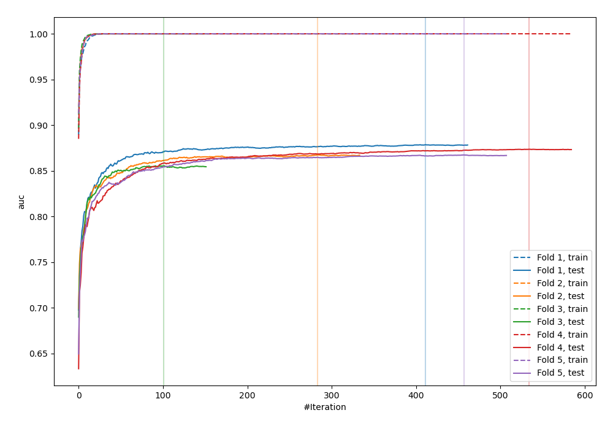
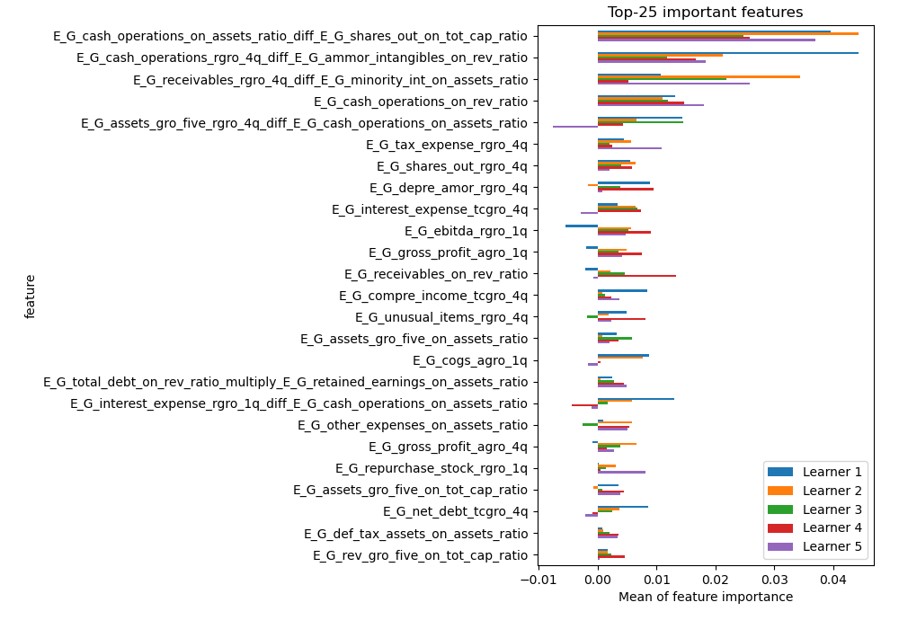
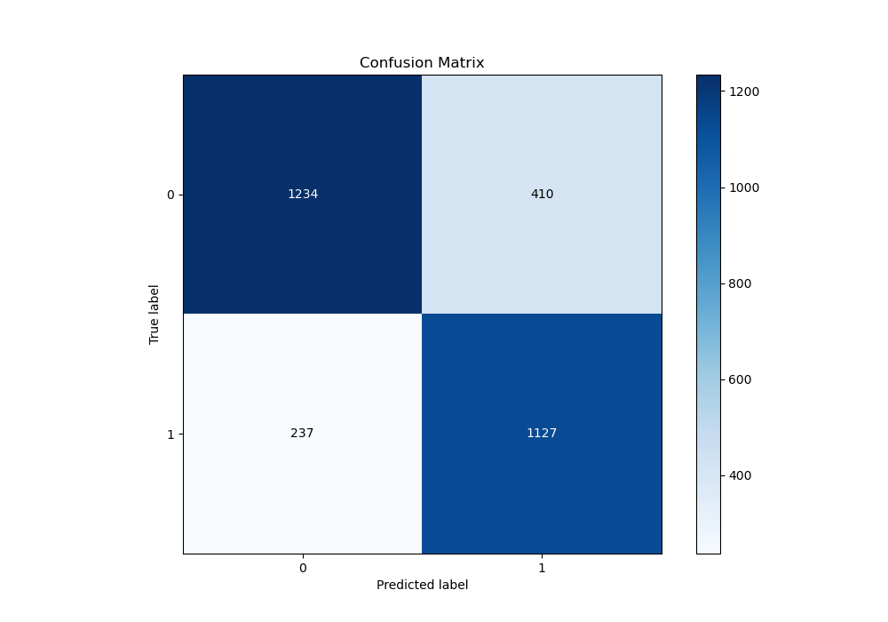
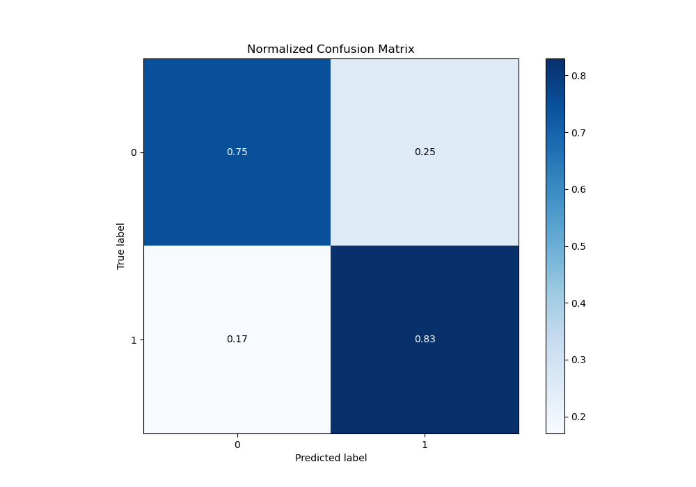
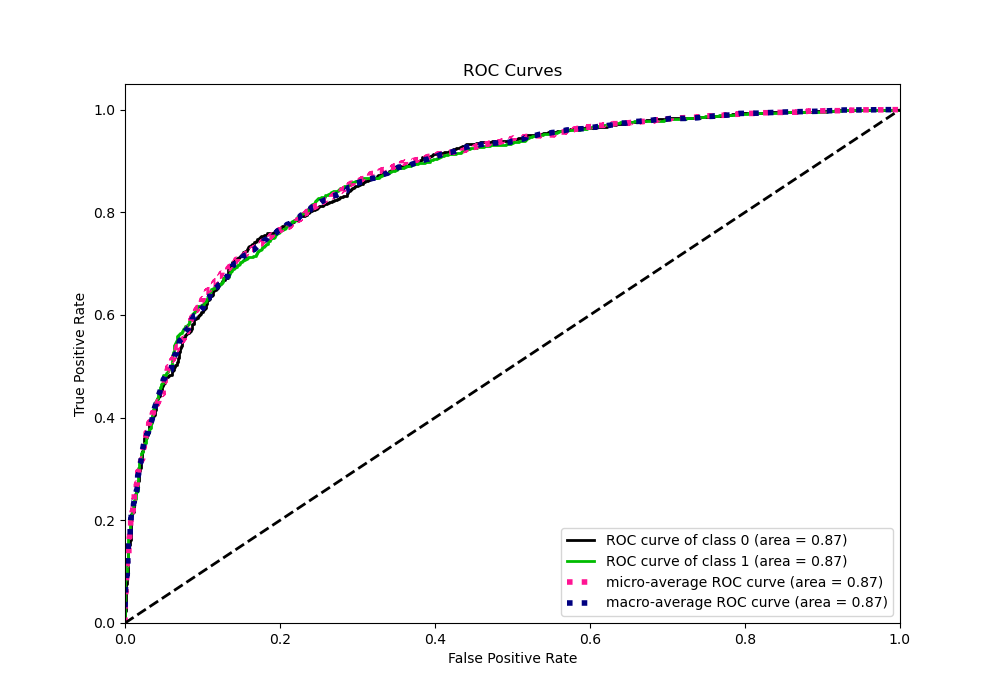
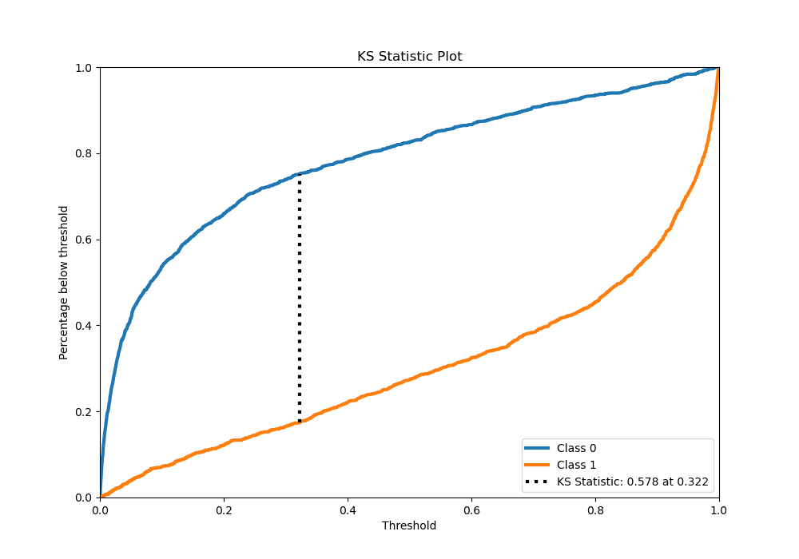
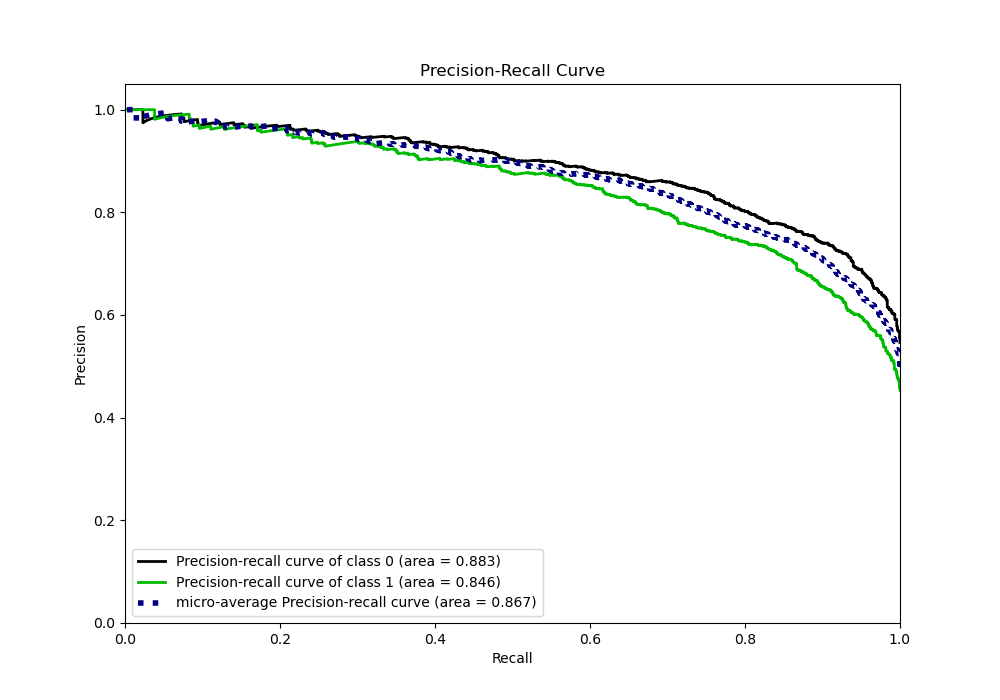
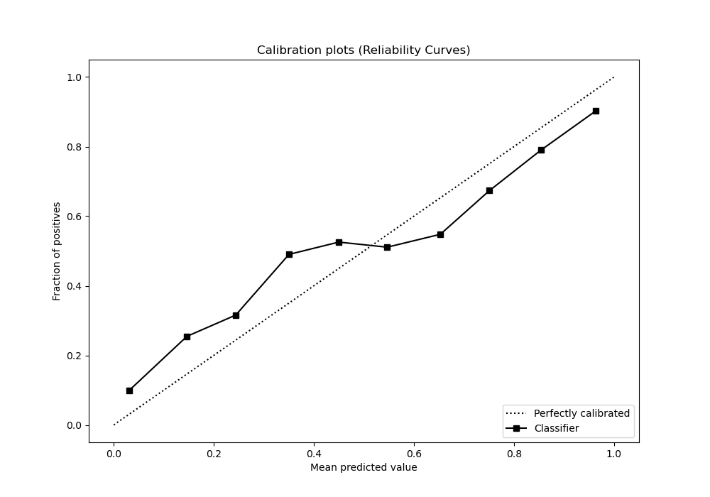
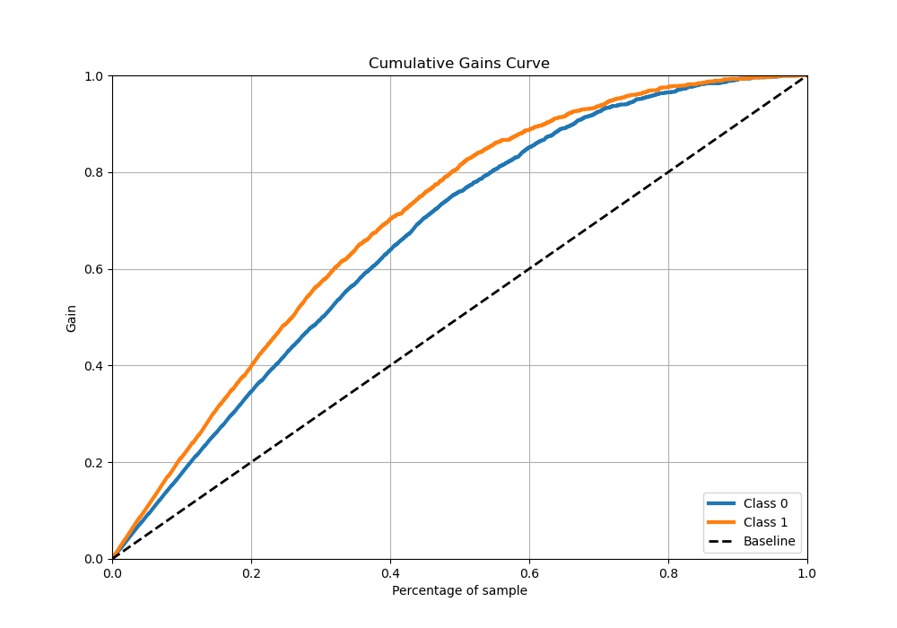

# Summary of 3_Xgboost_GoldenFeatures_SelectedFeatures

[<< Go back](../README.md)

## Extreme Gradient Boosting (Xgboost)
- **n_jobs**: -1
- **objective**: binary:logistic
- **eta**: 0.1
- **max_depth**: 8
- **min_child_weight**: 1
- **subsample**: 1.0
- **colsample_bytree**: 1.0
- **eval_metric**: auc
- **explain_level**: 1

## Validation
 - **validation_type**: kfold
 - **k_folds**: 5
 - **shuffle**: True
 - **stratify**: True

## Optimized metric
auc

## Training time

22.7 seconds

## Metric details
|           |    score |     threshold |
|:----------|---------:|--------------:|
| logloss   | 0.488763 | nan           |
| auc       | 0.866975 | nan           |
| f1        | 0.776973 |   0.321222    |
| accuracy  | 0.784907 |   0.321222    |
| precision | 1        |   0.997182    |
| recall    | 1        |   0.000180103 |
| mcc       | 0.574488 |   0.321222    |

## Metric details with threshold from accuracy metric
|           |    score |   threshold |
|:----------|---------:|------------:|
| logloss   | 0.488763 |  nan        |
| auc       | 0.866975 |  nan        |
| f1        | 0.776973 |    0.321222 |
| accuracy  | 0.784907 |    0.321222 |
| precision | 0.733247 |    0.321222 |
| recall    | 0.826246 |    0.321222 |
| mcc       | 0.574488 |    0.321222 |

## Confusion matrix (at threshold=0.321222)
|              |   Predicted as 0 |   Predicted as 1 |
|:-------------|-----------------:|-----------------:|
| Labeled as 0 |             1234 |              410 |
| Labeled as 1 |              237 |             1127 |

## Learning curves

## Permutation-based Importance

## Confusion Matrix

## Normalized Confusion Matrix

## ROC Curve

## Kolmogorov-Smirnov Statistic

## Precision-Recall Curve

## Calibration Curve

## Cumulative Gains Curve

## Lift Curve

[<< Go back](../README.md)
