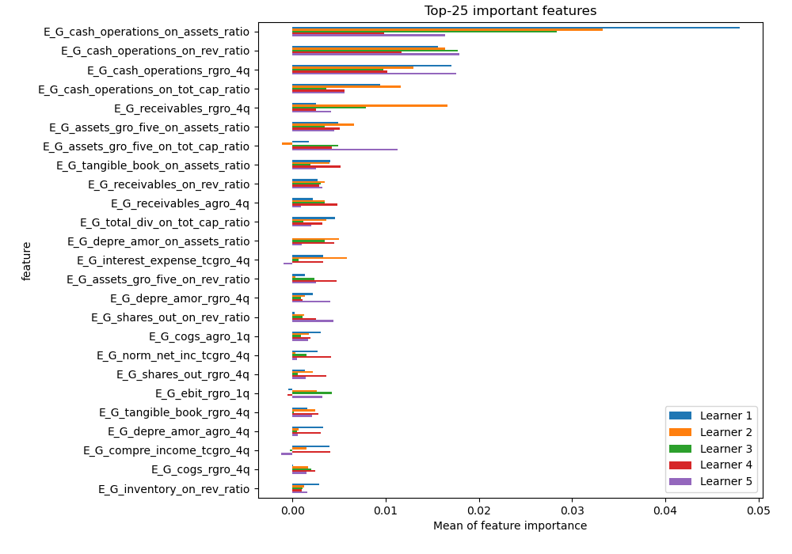
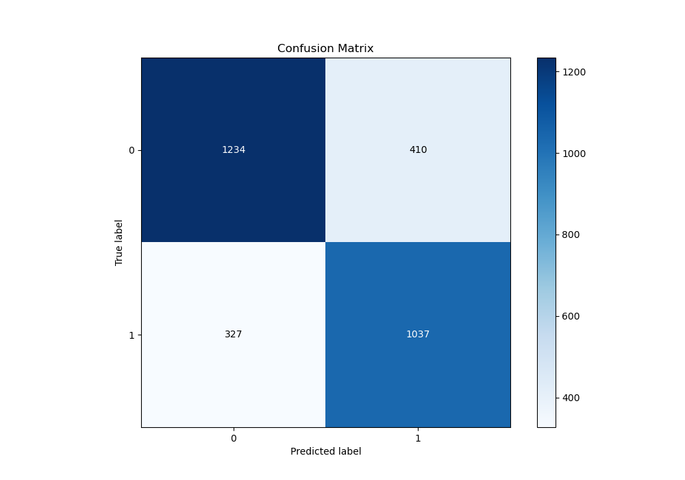
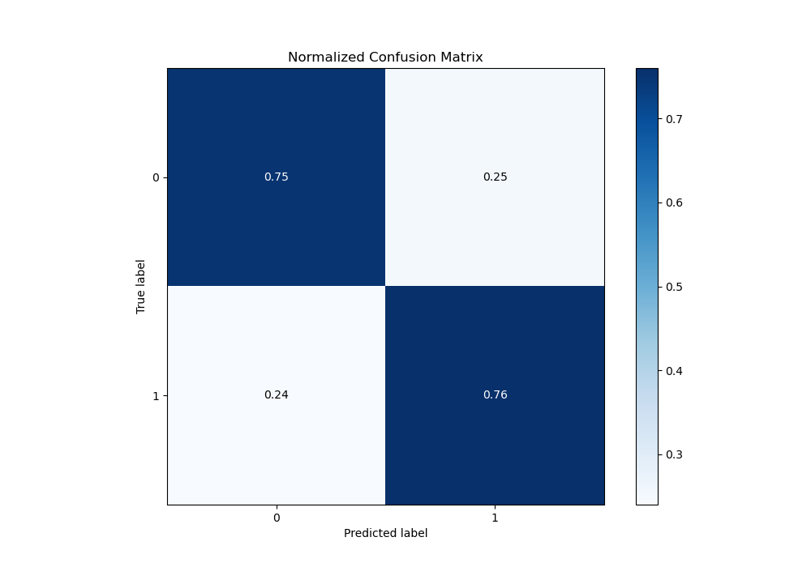
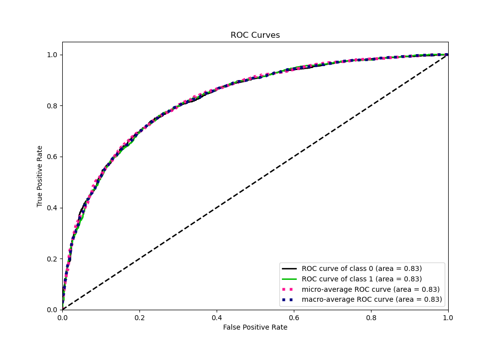
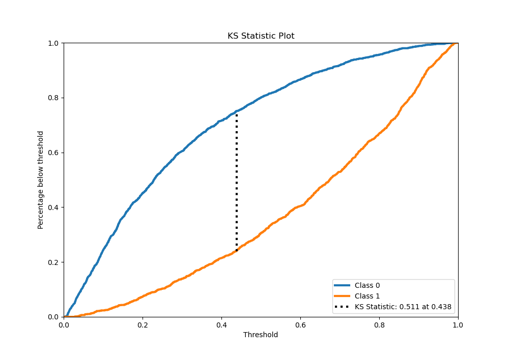
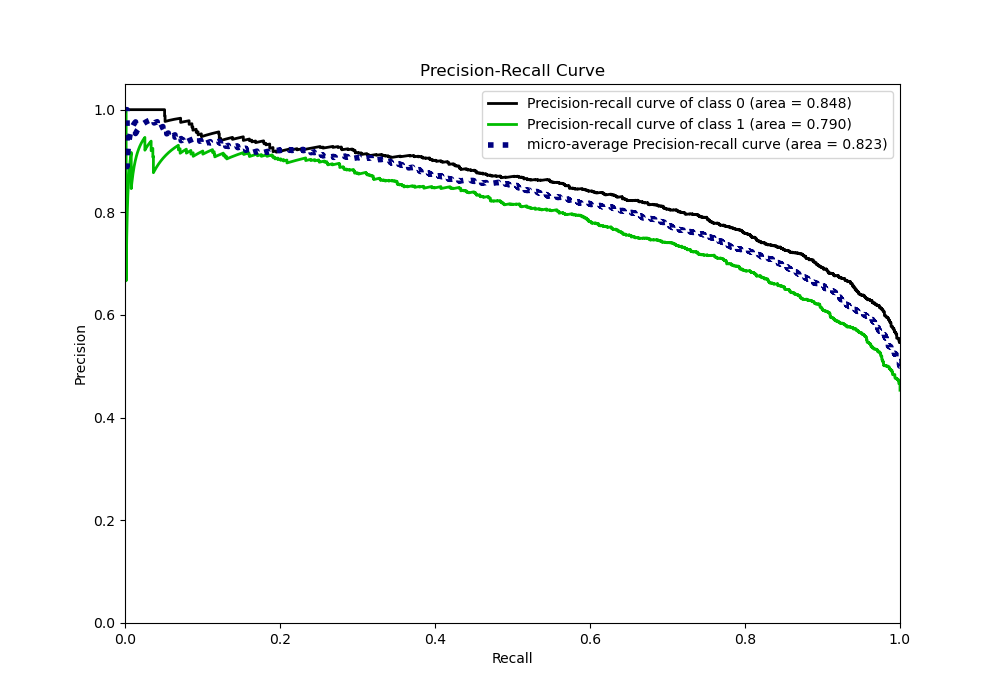
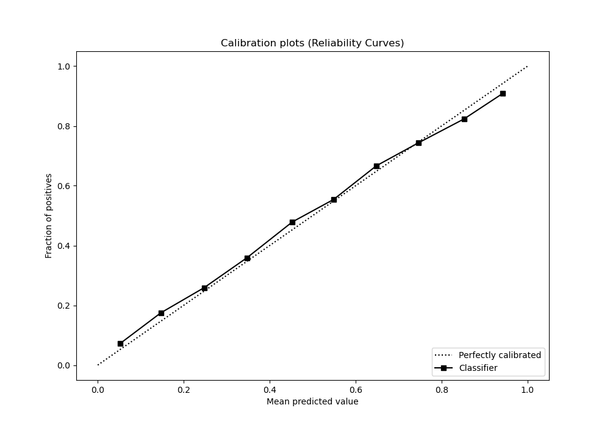
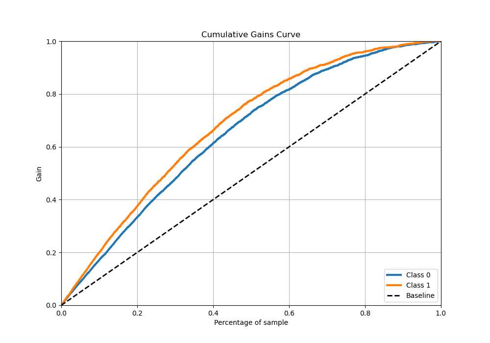
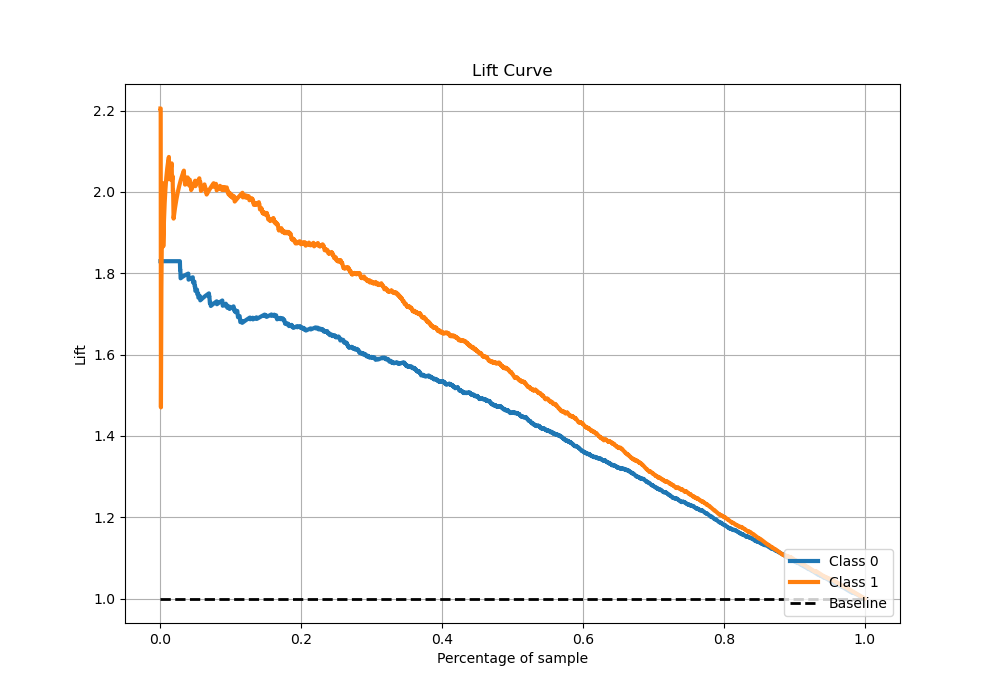

# Summary of 4_Xgboost

[<< Go back](../README.md)

## Extreme Gradient Boosting (Xgboost)
- **n_jobs**: -1
- **objective**: binary:logistic
- **eta**: 0.1
- **max_depth**: 7
- **min_child_weight**: 25
- **subsample**: 0.9
- **colsample_bytree**: 0.6
- **eval_metric**: auc
- **explain_level**: 1

## Validation
 - **validation_type**: kfold
 - **k_folds**: 5
 - **shuffle**: True
 - **stratify**: True

## Optimized metric
auc

## Training time

38.1 seconds

## Metric details
|           |    score |   threshold |
|:----------|---------:|------------:|
| logloss   | 0.51089  | nan         |
| auc       | 0.827475 | nan         |
| f1        | 0.741396 |   0.34414   |
| accuracy  | 0.754987 |   0.438325  |
| precision | 0.945946 |   0.973903  |
| recall    | 1        |   0.0038382 |
| mcc       | 0.50902  |   0.438325  |

## Metric details with threshold from accuracy metric
|           |    score |   threshold |
|:----------|---------:|------------:|
| logloss   | 0.51089  |  nan        |
| auc       | 0.827475 |  nan        |
| f1        | 0.737816 |    0.438325 |
| accuracy  | 0.754987 |    0.438325 |
| precision | 0.716655 |    0.438325 |
| recall    | 0.760264 |    0.438325 |
| mcc       | 0.50902  |    0.438325 |

## Confusion matrix (at threshold=0.438325)
|              |   Predicted as 0 |   Predicted as 1 |
|:-------------|-----------------:|-----------------:|
| Labeled as 0 |             1234 |              410 |
| Labeled as 1 |              327 |             1037 |

## Learning curves

## Permutation-based Importance

## Confusion Matrix

## Normalized Confusion Matrix

## ROC Curve

## Kolmogorov-Smirnov Statistic

## Precision-Recall Curve

## Calibration Curve

## Cumulative Gains Curve

## Lift Curve

[<< Go back](../README.md)
