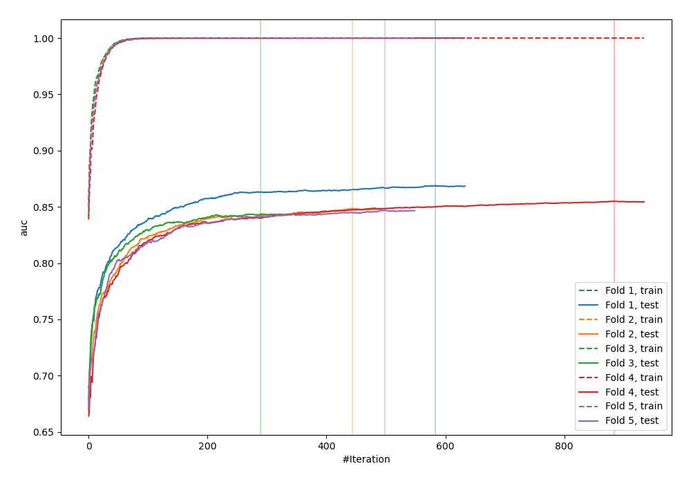
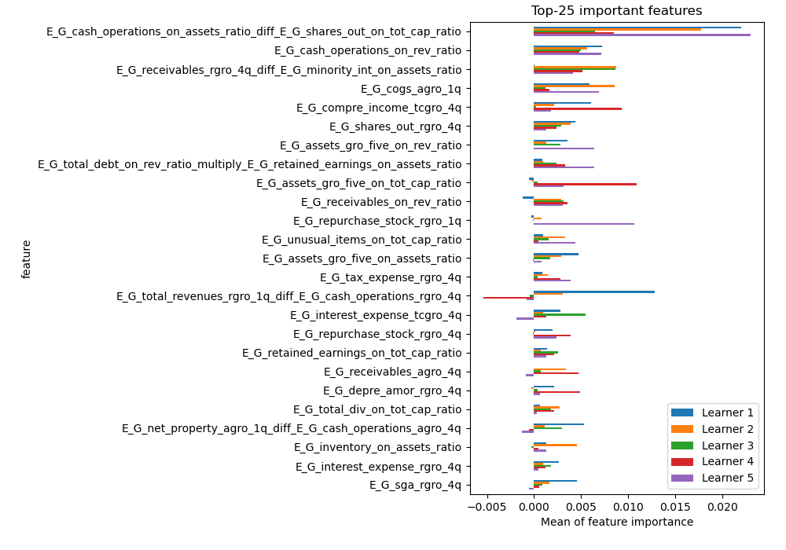
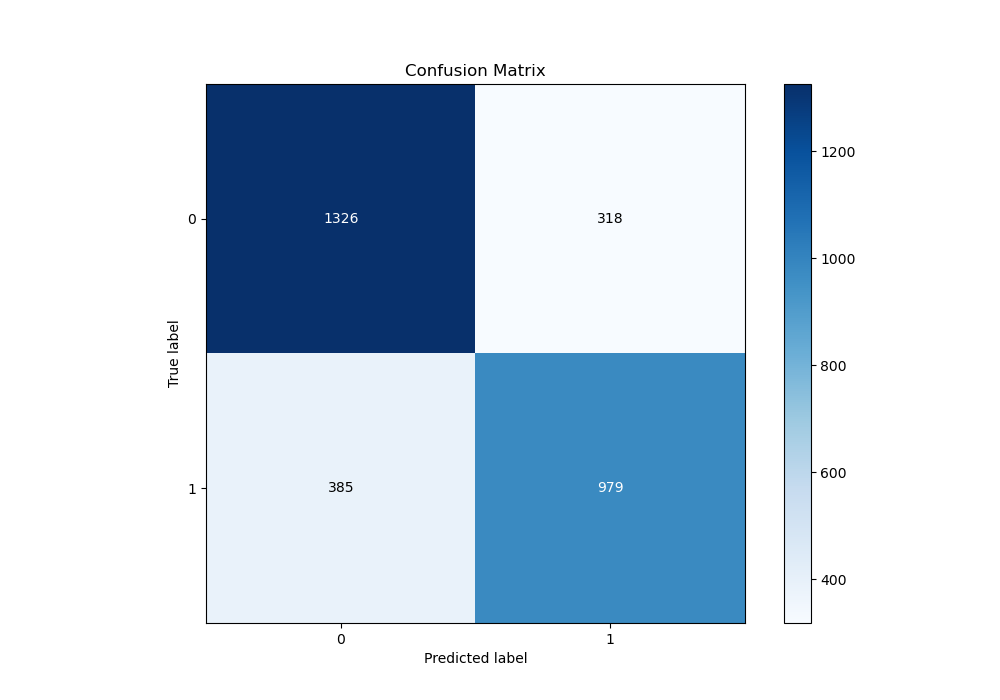
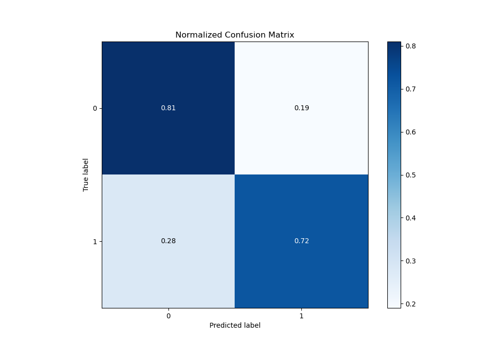
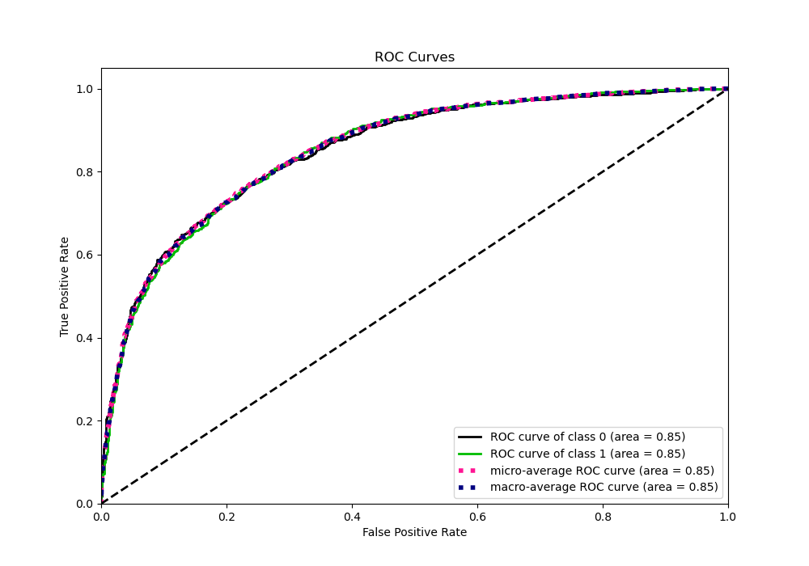
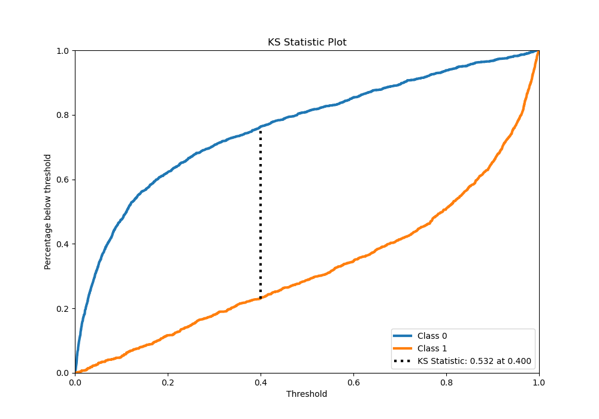
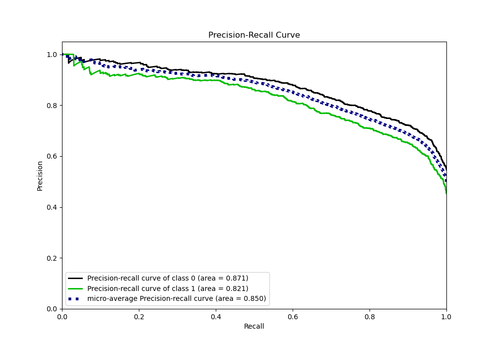
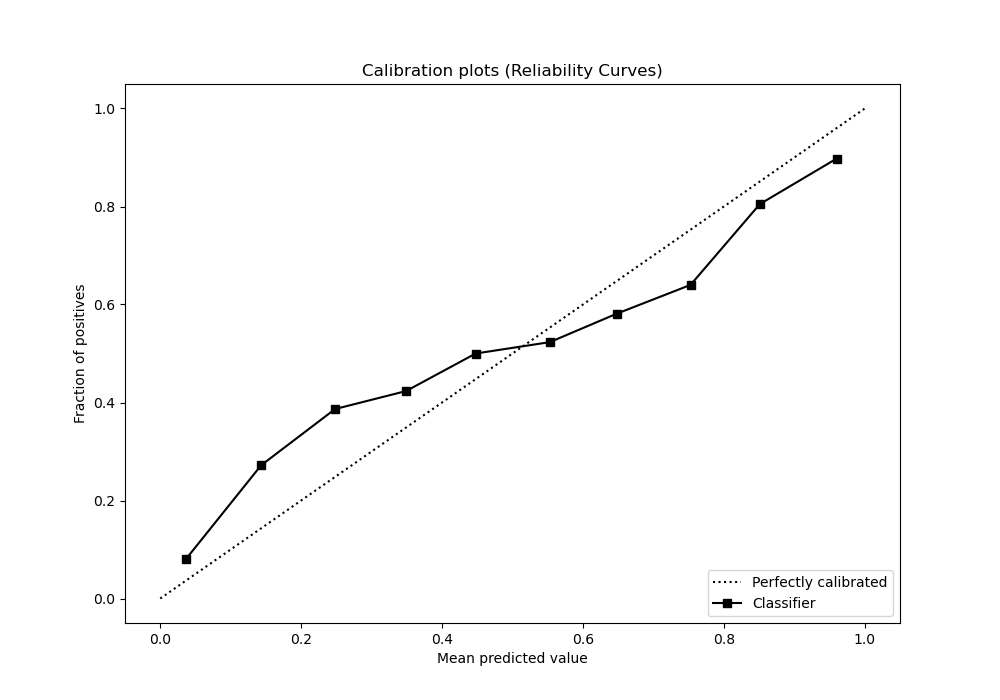
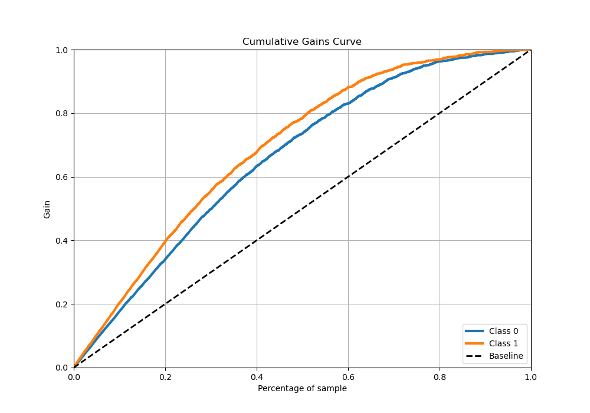
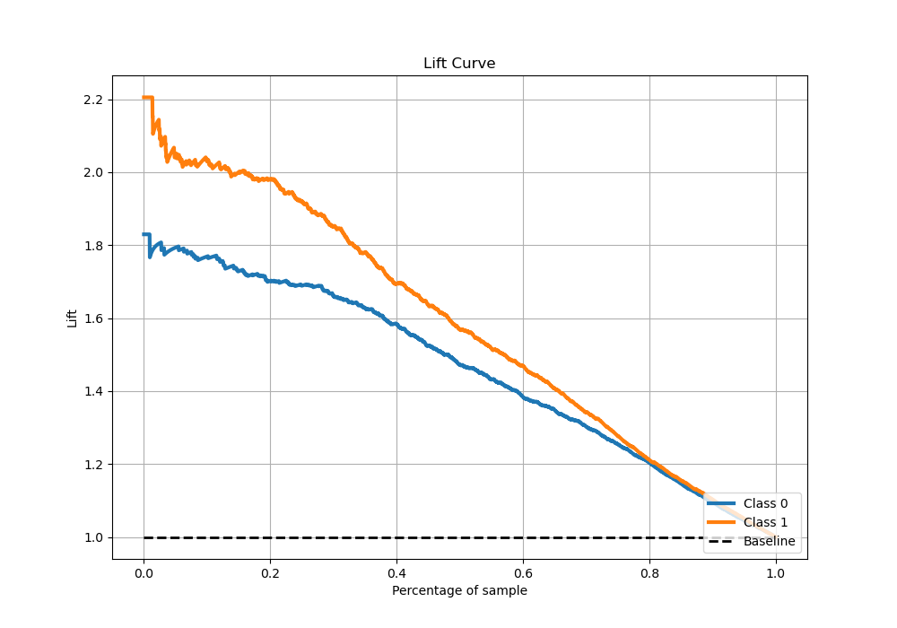

# Summary of 8_Xgboost_GoldenFeatures

[<< Go back](../README.md)

## Extreme Gradient Boosting (Xgboost)
- **n_jobs**: -1
- **objective**: binary:logistic
- **eta**: 0.05
- **max_depth**: 6
- **min_child_weight**: 1
- **subsample**: 1.0
- **colsample_bytree**: 1.0
- **eval_metric**: auc
- **explain_level**: 1

## Validation
 - **validation_type**: kfold
 - **k_folds**: 5
 - **shuffle**: True
 - **stratify**: True

## Optimized metric
auc

## Training time

72.2 seconds

## Metric details
|           |    score |     threshold |
|:----------|---------:|--------------:|
| logloss   | 0.503668 | nan           |
| auc       | 0.851499 | nan           |
| f1        | 0.758751 |   0.211067    |
| accuracy  | 0.76629  |   0.489773    |
| precision | 1        |   0.994797    |
| recall    | 1        |   0.000205805 |
| mcc       | 0.529044 |   0.41316     |

## Metric details with threshold from accuracy metric
|           |    score |   threshold |
|:----------|---------:|------------:|
| logloss   | 0.503668 |  nan        |
| auc       | 0.851499 |  nan        |
| f1        | 0.735814 |    0.489773 |
| accuracy  | 0.76629  |    0.489773 |
| precision | 0.754819 |    0.489773 |
| recall    | 0.717742 |    0.489773 |
| mcc       | 0.527051 |    0.489773 |

## Confusion matrix (at threshold=0.489773)
|              |   Predicted as 0 |   Predicted as 1 |
|:-------------|-----------------:|-----------------:|
| Labeled as 0 |             1326 |              318 |
| Labeled as 1 |              385 |              979 |

## Learning curves

## Permutation-based Importance

## Confusion Matrix

## Normalized Confusion Matrix

## ROC Curve

## Kolmogorov-Smirnov Statistic

## Precision-Recall Curve

## Calibration Curve

## Cumulative Gains Curve

## Lift Curve

[<< Go back](../README.md)
