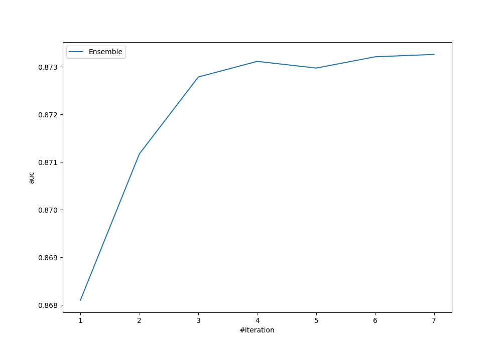
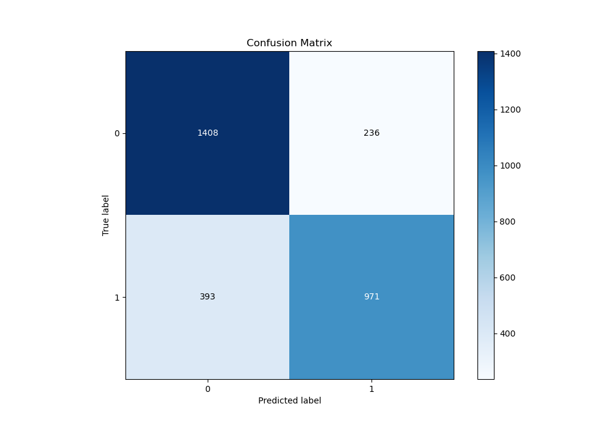
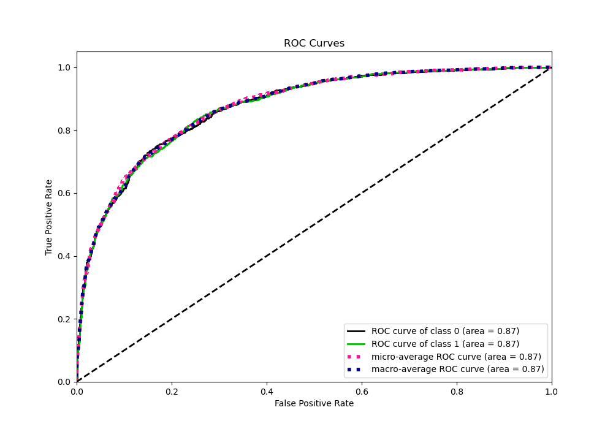
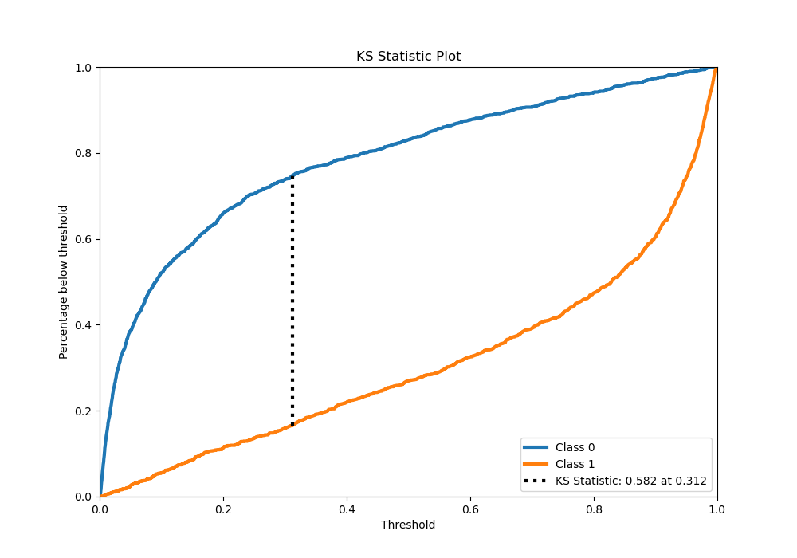
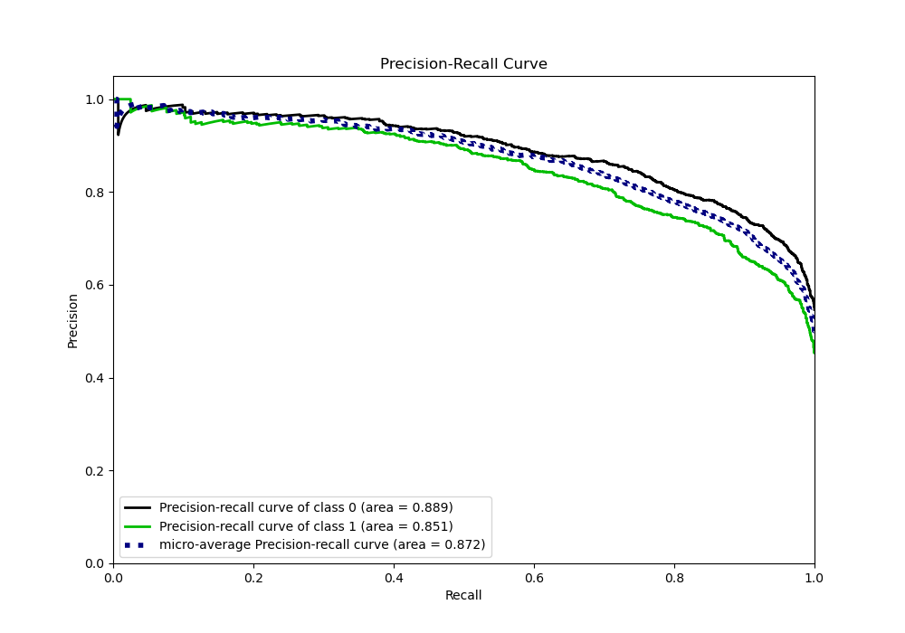
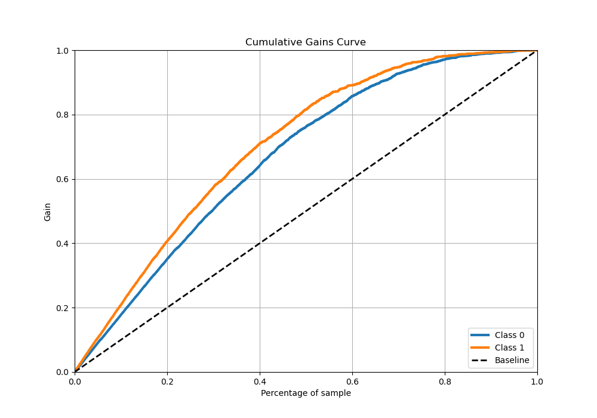
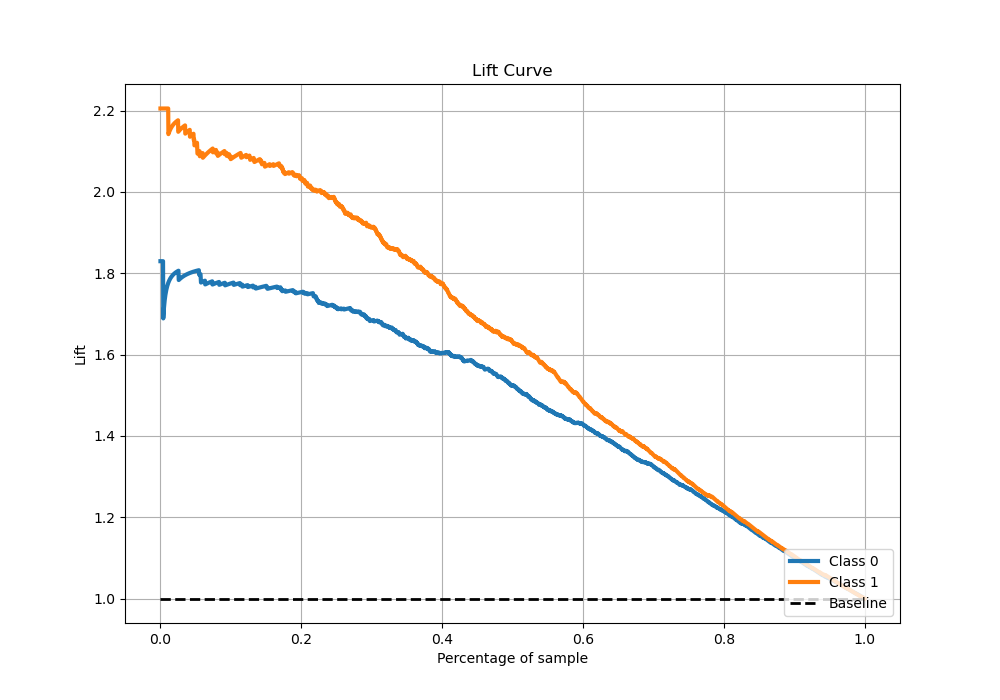

# Summary of Ensemble

[<< Go back](../README.md)

## Ensemble structure
| Model                                      |   Weight |
|:-------------------------------------------|---------:|
| 11_Xgboost_GoldenFeatures_SelectedFeatures |        2 |
| 3_Xgboost_GoldenFeatures_SelectedFeatures  |        2 |
| 6_Xgboost_GoldenFeatures_SelectedFeatures  |        1 |
| 7_Xgboost_GoldenFeatures_SelectedFeatures  |        1 |
| 9_Xgboost_GoldenFeatures                   |        1 |

## Metric details
|           |    score |     threshold |
|:----------|---------:|--------------:|
| logloss   | 0.463551 | nan           |
| auc       | 0.873261 | nan           |
| f1        | 0.780817 |   0.288138    |
| accuracy  | 0.790891 |   0.5474      |
| precision | 0.985075 |   0.991205    |
| recall    | 1        |   0.000419602 |
| mcc       | 0.578496 |   0.318363    |

## Metric details with threshold from accuracy metric
|           |    score |   threshold |
|:----------|---------:|------------:|
| logloss   | 0.463551 |    nan      |
| auc       | 0.873261 |    nan      |
| f1        | 0.755348 |      0.5474 |
| accuracy  | 0.790891 |      0.5474 |
| precision | 0.804474 |      0.5474 |
| recall    | 0.711877 |      0.5474 |
| mcc       | 0.577223 |      0.5474 |

## Confusion matrix (at threshold=0.5474)
|              |   Predicted as 0 |   Predicted as 1 |
|:-------------|-----------------:|-----------------:|
| Labeled as 0 |             1408 |              236 |
| Labeled as 1 |              393 |              971 |

## Learning curves

## Confusion Matrix

## Normalized Confusion Matrix

## ROC Curve

## Kolmogorov-Smirnov Statistic

## Precision-Recall Curve

## Calibration Curve

## Cumulative Gains Curve

## Lift Curve

[<< Go back](../README.md)
