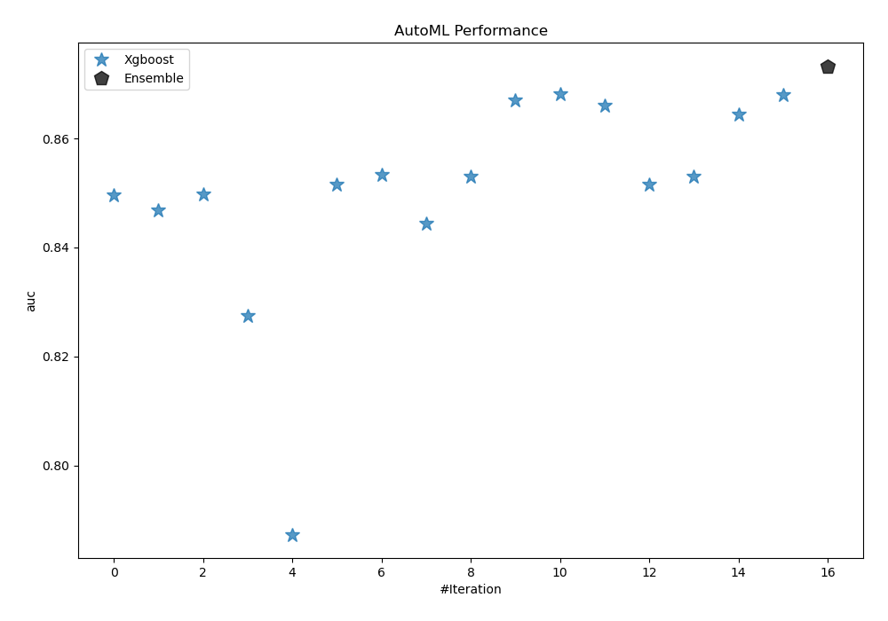
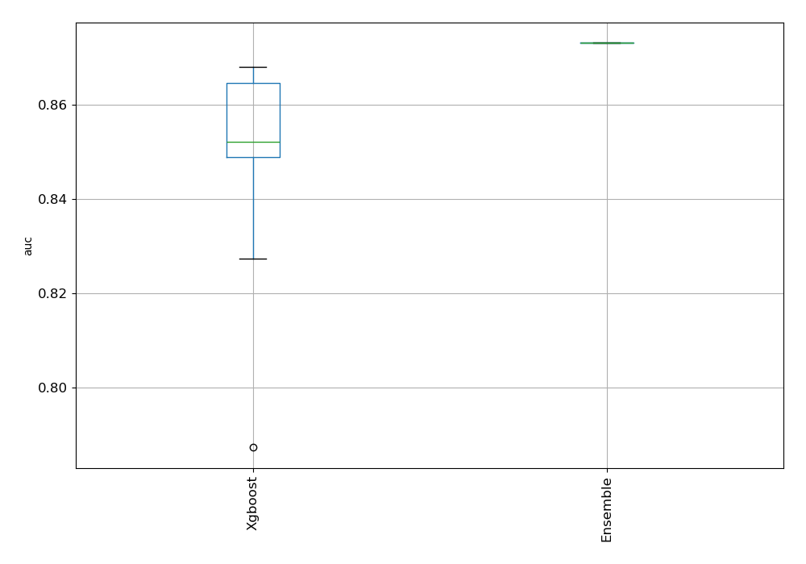
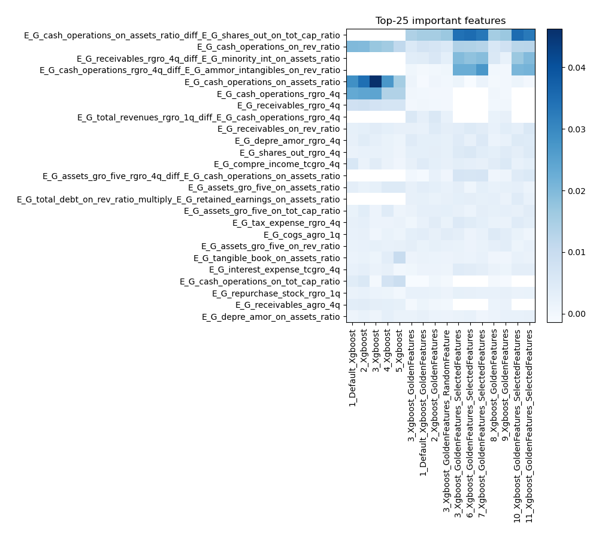
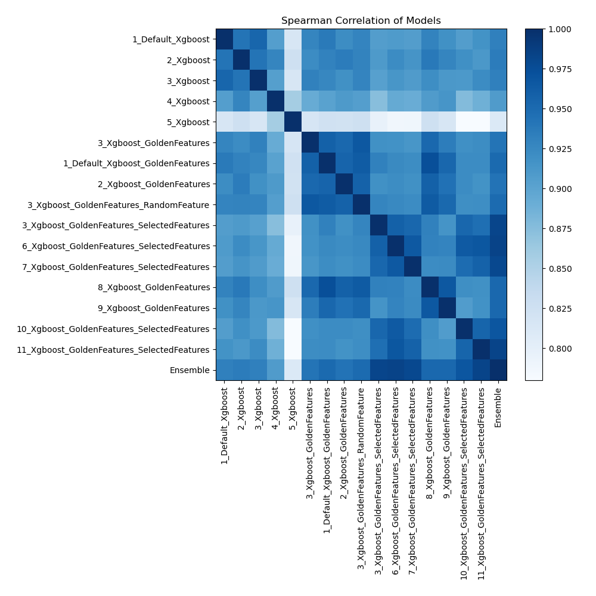

# AutoML Leaderboard

| Best model   | name                                                                                               | model_type   | metric_type   |   metric_value |   train_time |   single_prediction_time |
|:-------------|:---------------------------------------------------------------------------------------------------|:-------------|:--------------|---------------:|-------------:|-------------------------:|
|              | [1_Default_Xgboost](1_Default_Xgboost/README.md)                                                   | Xgboost      | auc           |       0.849589 |        50.36 |                   0.1456 |
|              | [2_Xgboost](2_Xgboost/README.md)                                                                   | Xgboost      | auc           |       0.846898 |        55.24 |                   0.1814 |
|              | [3_Xgboost](3_Xgboost/README.md)                                                                   | Xgboost      | auc           |       0.849764 |        50.74 |                   0.1734 |
|              | [4_Xgboost](4_Xgboost/README.md)                                                                   | Xgboost      | auc           |       0.827475 |        38.58 |                   0.1723 |
|              | [5_Xgboost](5_Xgboost/README.md)                                                                   | Xgboost      | auc           |       0.787346 |        30.58 |                   0.1822 |
|              | [3_Xgboost_GoldenFeatures](3_Xgboost_GoldenFeatures/README.md)                                     | Xgboost      | auc           |       0.851621 |       166.63 |                   0.2663 |
|              | [1_Default_Xgboost_GoldenFeatures](1_Default_Xgboost_GoldenFeatures/README.md)                     | Xgboost      | auc           |       0.853333 |       406.88 |                   0.2554 |
|              | [2_Xgboost_GoldenFeatures](2_Xgboost_GoldenFeatures/README.md)                                     | Xgboost      | auc           |       0.844325 |        53.59 |                   0.2648 |
|              | [3_Xgboost_GoldenFeatures_RandomFeature](3_Xgboost_GoldenFeatures_RandomFeature/README.md)         | Xgboost      | auc           |       0.85293  |        59.43 |                   0.2949 |
|              | [3_Xgboost_GoldenFeatures_SelectedFeatures](3_Xgboost_GoldenFeatures_SelectedFeatures/README.md)   | Xgboost      | auc           |       0.866975 |        23.2  |                   0.0807 |
| **the best** | [6_Xgboost_GoldenFeatures_SelectedFeatures](6_Xgboost_GoldenFeatures_SelectedFeatures/README.md)   | Xgboost      | auc           |       0.868103 |        28.81 |                   0.0756 |
|              | [7_Xgboost_GoldenFeatures_SelectedFeatures](7_Xgboost_GoldenFeatures_SelectedFeatures/README.md)   | Xgboost      | auc           |       0.866017 |        18.36 |                   0.0757 |
|              | [8_Xgboost_GoldenFeatures](8_Xgboost_GoldenFeatures/README.md)                                     | Xgboost      | auc           |       0.851499 |        72.95 |                   0.1681 |
|              | [9_Xgboost_GoldenFeatures](9_Xgboost_GoldenFeatures/README.md)                                     | Xgboost      | auc           |       0.853034 |        54.91 |                   0.1611 |
|              | [10_Xgboost_GoldenFeatures_SelectedFeatures](10_Xgboost_GoldenFeatures_SelectedFeatures/README.md) | Xgboost      | auc           |       0.864346 |       755.26 |                   0.0751 |
|              | [11_Xgboost_GoldenFeatures_SelectedFeatures](11_Xgboost_GoldenFeatures_SelectedFeatures/README.md) | Xgboost      | auc           |       0.867956 |        81.56 |                   0.0722 |
|              | [Ensemble](Ensemble/README.md)                                                                     | Ensemble     | auc           |       0.873261 |         0.88 |                   0.6722 |

### AutoML Performance

### AutoML Performance Boxplot

### Features Importance

### Spearman Correlation of Models

