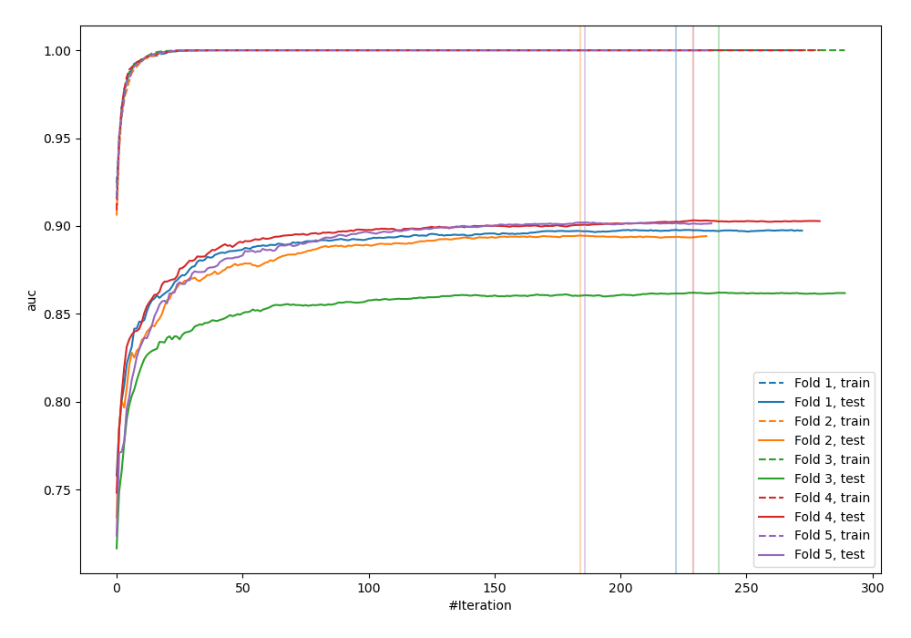
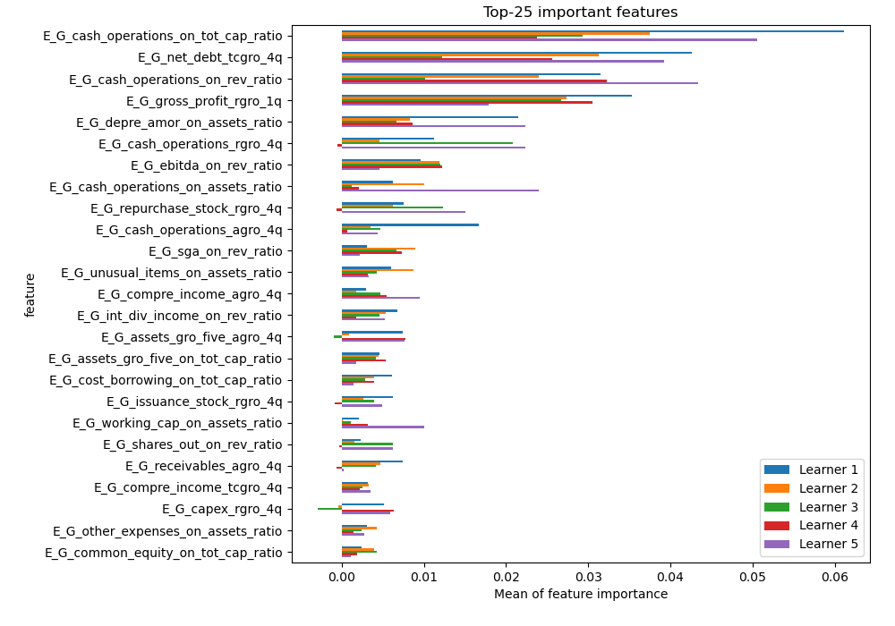
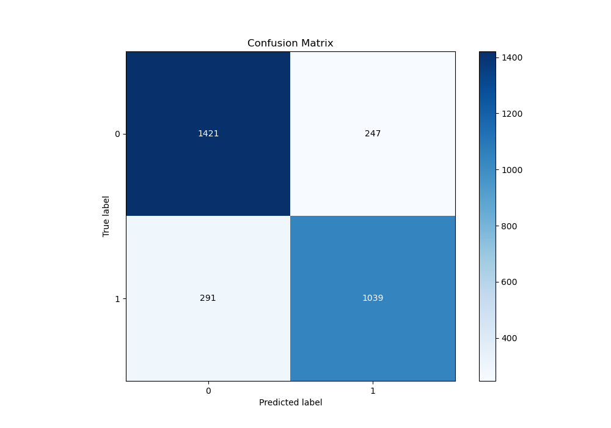
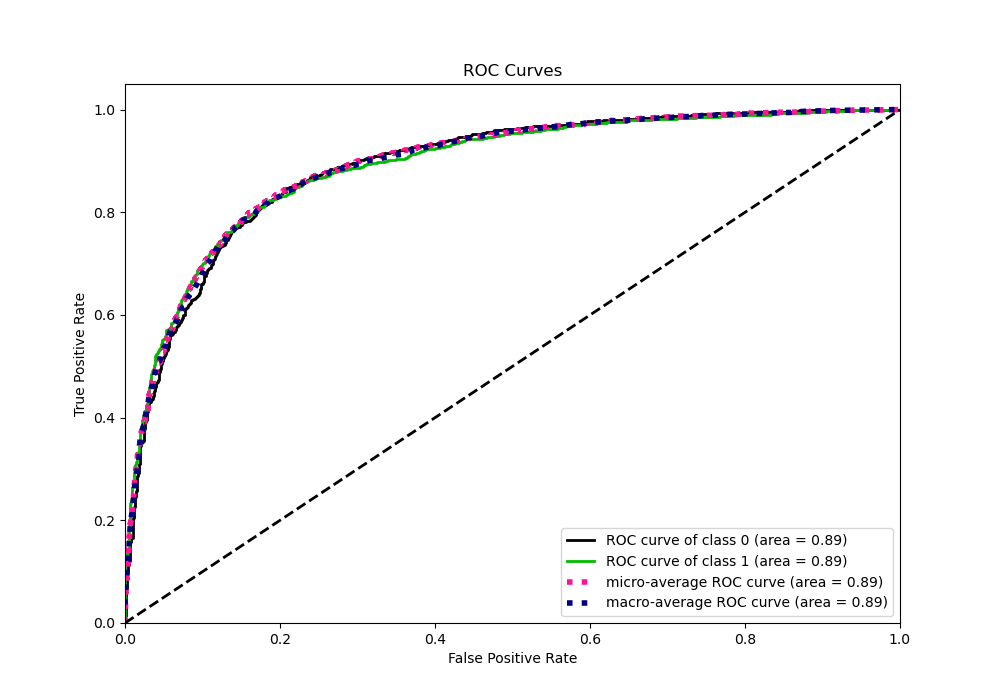
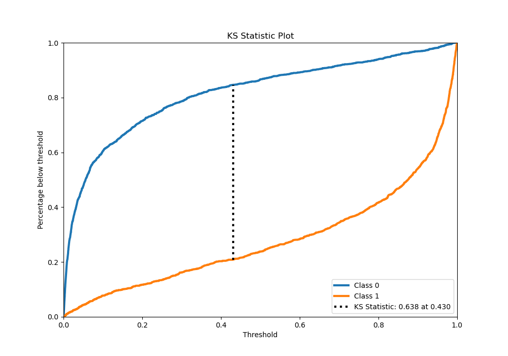
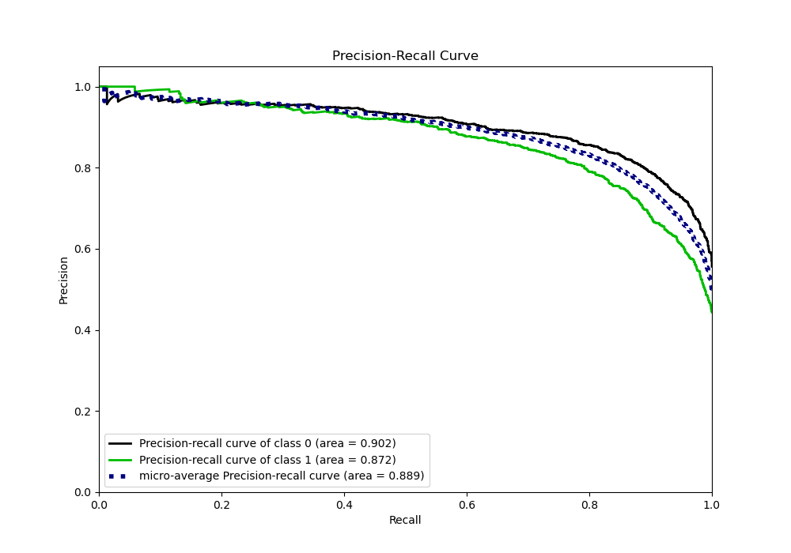
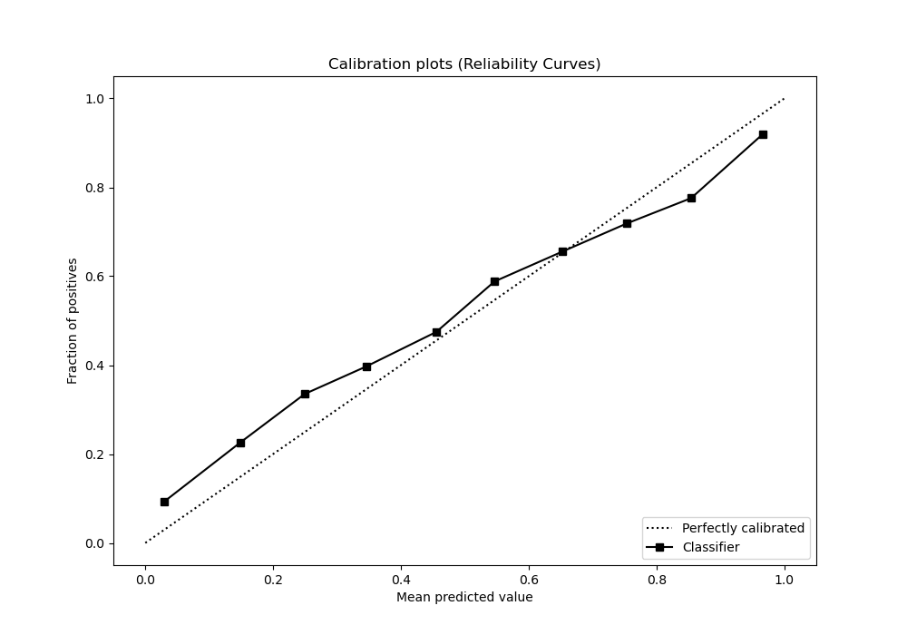
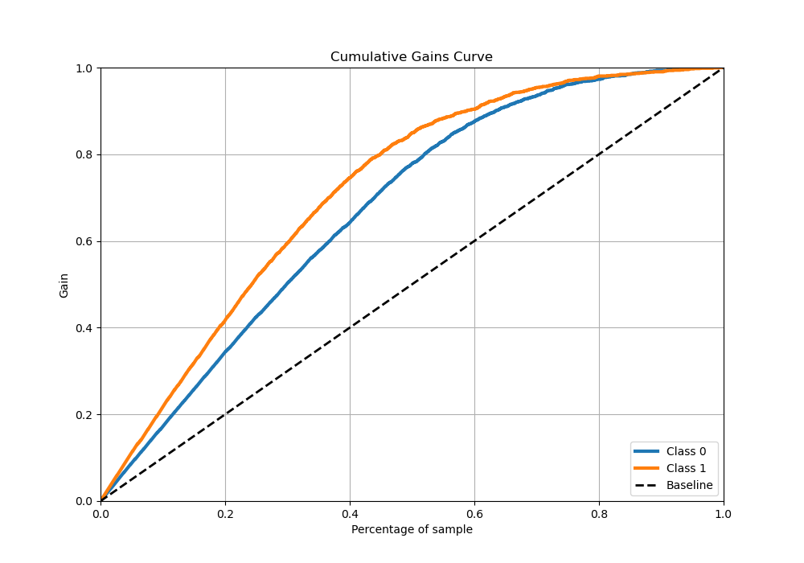
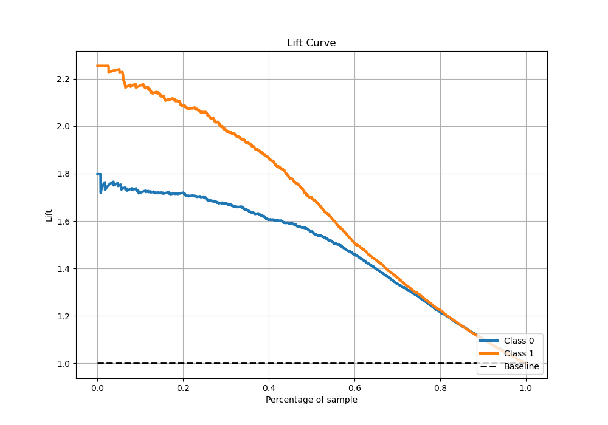

# Summary of 3_Xgboost_SelectedFeatures

[<< Go back](../README.md)

## Extreme Gradient Boosting (Xgboost)
- **n_jobs**: -1
- **objective**: binary:logistic
- **eta**: 0.1
- **max_depth**: 8
- **min_child_weight**: 1
- **subsample**: 1.0
- **colsample_bytree**: 1.0
- **eval_metric**: auc
- **explain_level**: 1

## Validation
 - **validation_type**: kfold
 - **k_folds**: 5
 - **shuffle**: True
 - **stratify**: True

## Optimized metric
auc

## Training time

12.6 seconds

## Metric details
|           |    score |    threshold |
|:----------|---------:|-------------:|
| logloss   | 0.442053 | nan          |
| auc       | 0.891052 | nan          |
| f1        | 0.799414 |   0.348109   |
| accuracy  | 0.820547 |   0.459011   |
| precision | 0.992063 |   0.990788   |
| recall    | 1        |   0.00018669 |
| mcc       | 0.635534 |   0.459011   |

## Metric details with threshold from accuracy metric
|           |    score |   threshold |
|:----------|---------:|------------:|
| logloss   | 0.442053 |  nan        |
| auc       | 0.891052 |  nan        |
| f1        | 0.794343 |    0.459011 |
| accuracy  | 0.820547 |    0.459011 |
| precision | 0.807932 |    0.459011 |
| recall    | 0.781203 |    0.459011 |
| mcc       | 0.635534 |    0.459011 |

## Confusion matrix (at threshold=0.459011)
|              |   Predicted as 0 |   Predicted as 1 |
|:-------------|-----------------:|-----------------:|
| Labeled as 0 |             1421 |              247 |
| Labeled as 1 |              291 |             1039 |

## Learning curves

## Permutation-based Importance

## Confusion Matrix

## Normalized Confusion Matrix

## ROC Curve

## Kolmogorov-Smirnov Statistic

## Precision-Recall Curve

## Calibration Curve

## Cumulative Gains Curve

## Lift Curve

[<< Go back](../README.md)
