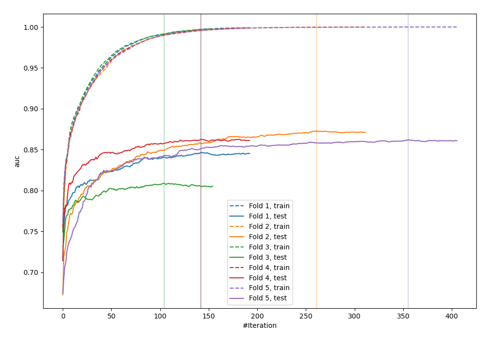
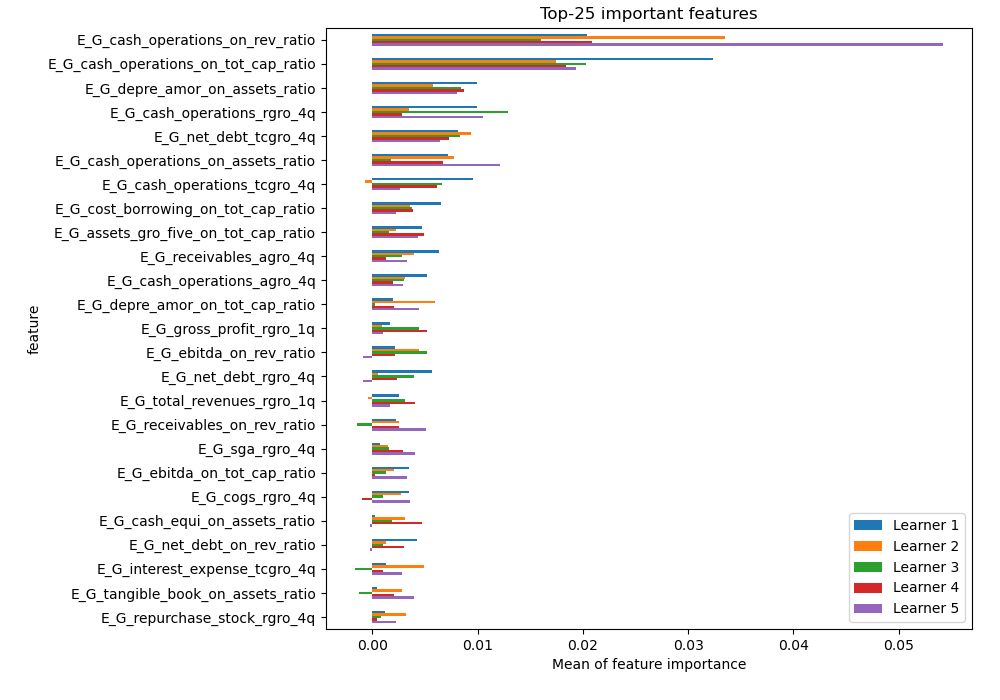
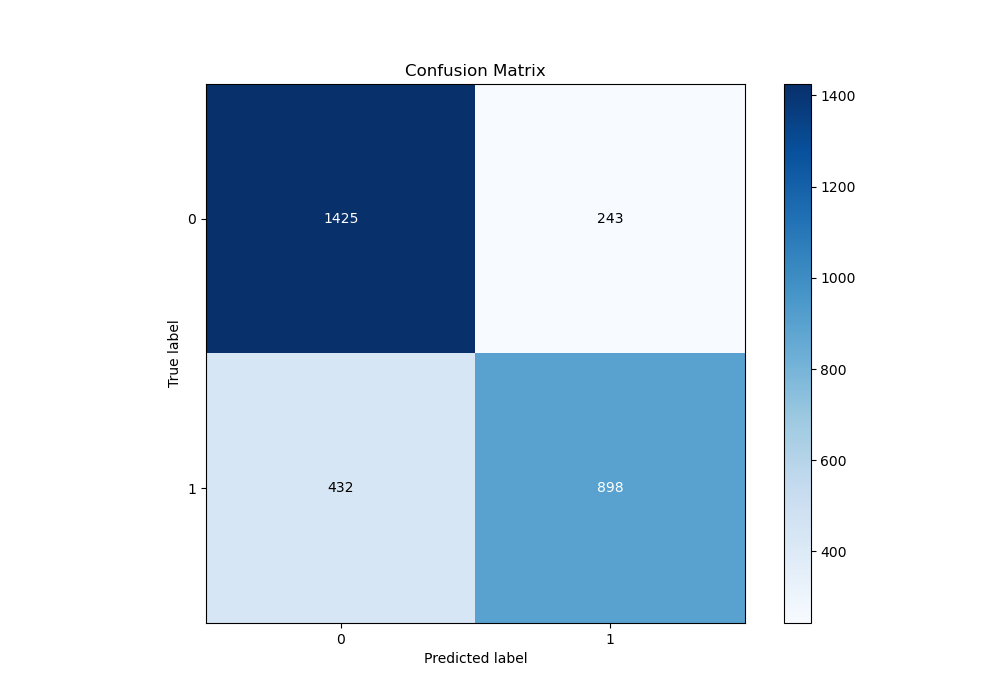
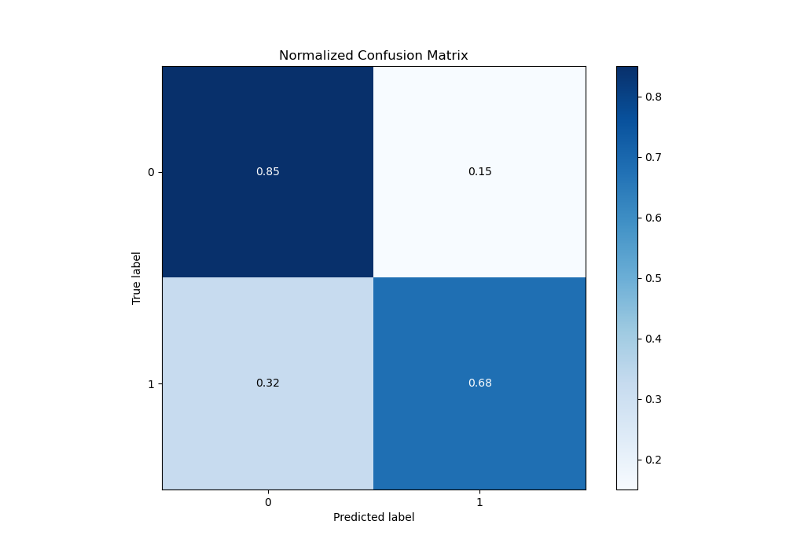
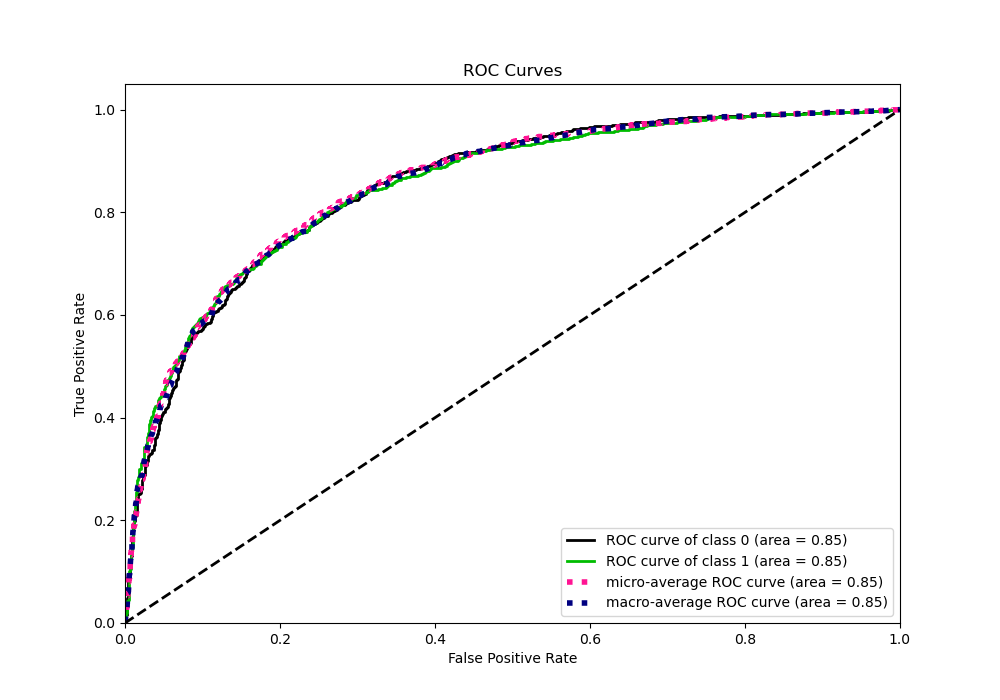
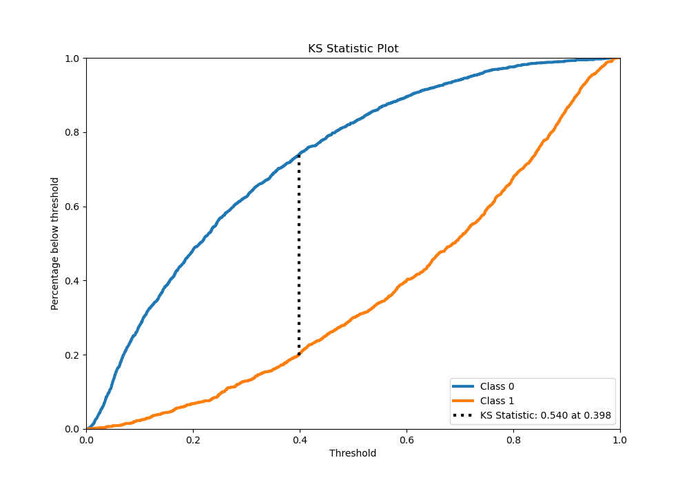
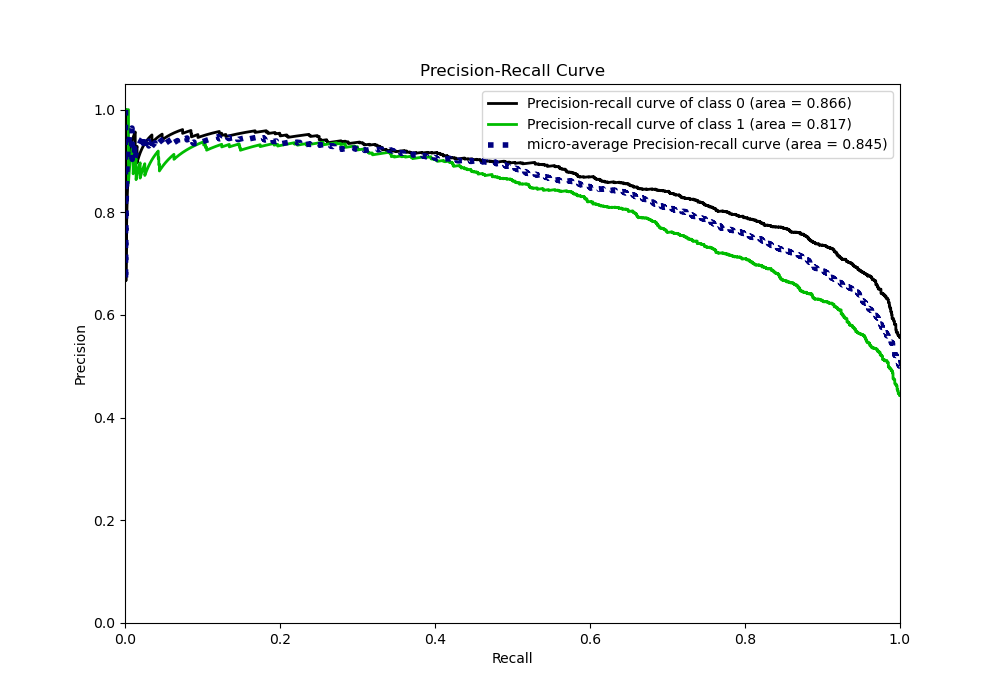
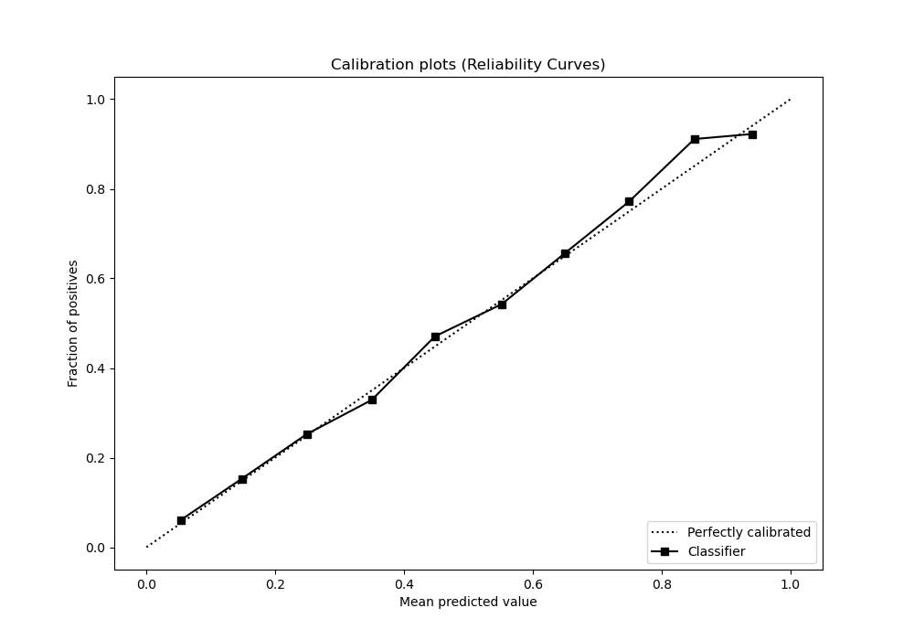
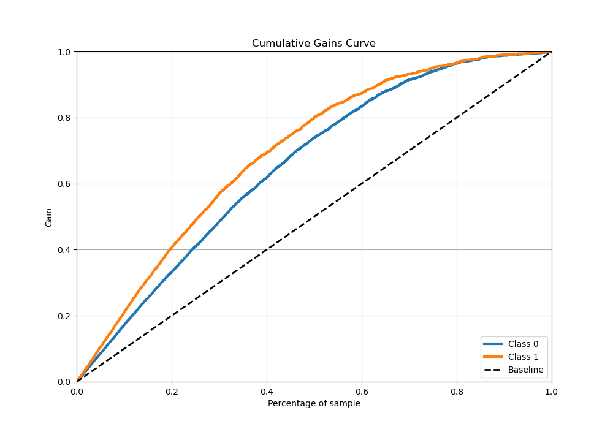
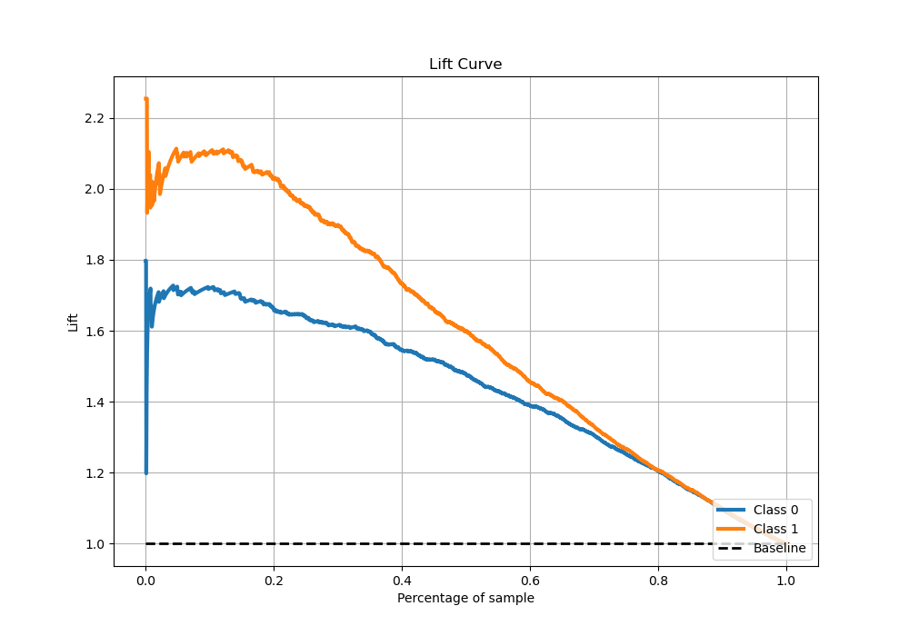

# Summary of 4_Xgboost

[<< Go back](../README.md)

## Extreme Gradient Boosting (Xgboost)
- **n_jobs**: -1
- **objective**: binary:logistic
- **eta**: 0.1
- **max_depth**: 7
- **min_child_weight**: 25
- **subsample**: 0.9
- **colsample_bytree**: 0.6
- **eval_metric**: auc
- **explain_level**: 1

## Validation
 - **validation_type**: kfold
 - **k_folds**: 5
 - **shuffle**: True
 - **stratify**: True

## Optimized metric
auc

## Training time

33.4 seconds

## Metric details
|           |    score |     threshold |
|:----------|---------:|--------------:|
| logloss   | 0.478535 | nan           |
| auc       | 0.851289 | nan           |
| f1        | 0.755026 |   0.360489    |
| accuracy  | 0.77485  |   0.535178    |
| precision | 0.935754 |   0.844238    |
| recall    | 1        |   0.000769609 |
| mcc       | 0.54307  |   0.559596    |

## Metric details with threshold from accuracy metric
|           |    score |   threshold |
|:----------|---------:|------------:|
| logloss   | 0.478535 |  nan        |
| auc       | 0.851289 |  nan        |
| f1        | 0.726831 |    0.535178 |
| accuracy  | 0.77485  |    0.535178 |
| precision | 0.787029 |    0.535178 |
| recall    | 0.675188 |    0.535178 |
| mcc       | 0.541807 |    0.535178 |

## Confusion matrix (at threshold=0.535178)
|              |   Predicted as 0 |   Predicted as 1 |
|:-------------|-----------------:|-----------------:|
| Labeled as 0 |             1425 |              243 |
| Labeled as 1 |              432 |              898 |

## Learning curves

## Permutation-based Importance

## Confusion Matrix

## Normalized Confusion Matrix

## ROC Curve

## Kolmogorov-Smirnov Statistic

## Precision-Recall Curve

## Calibration Curve

## Cumulative Gains Curve

## Lift Curve

[<< Go back](../README.md)
