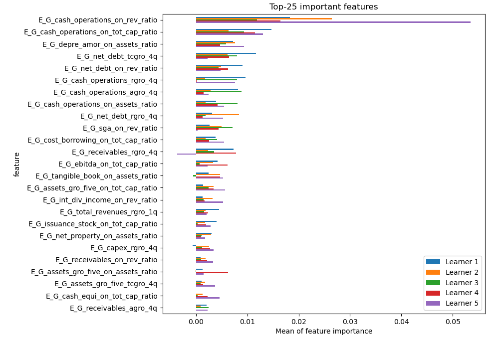
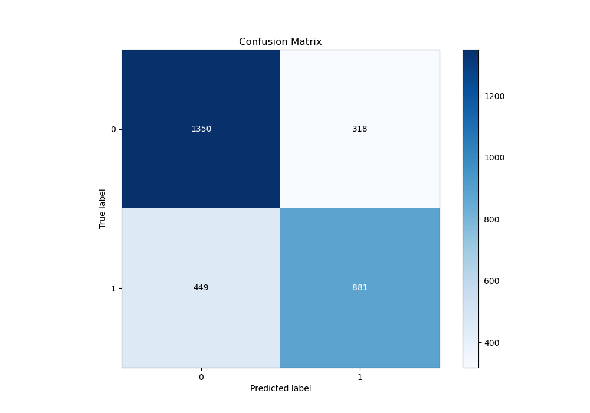
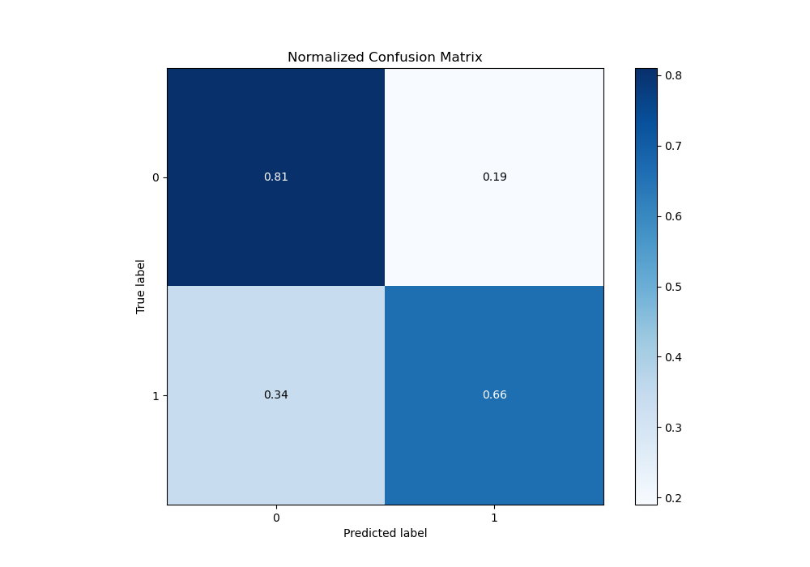
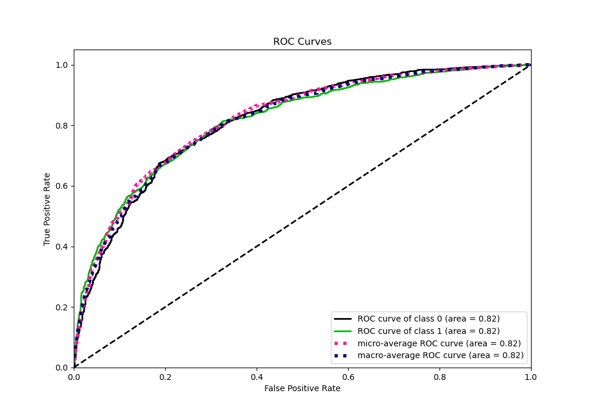
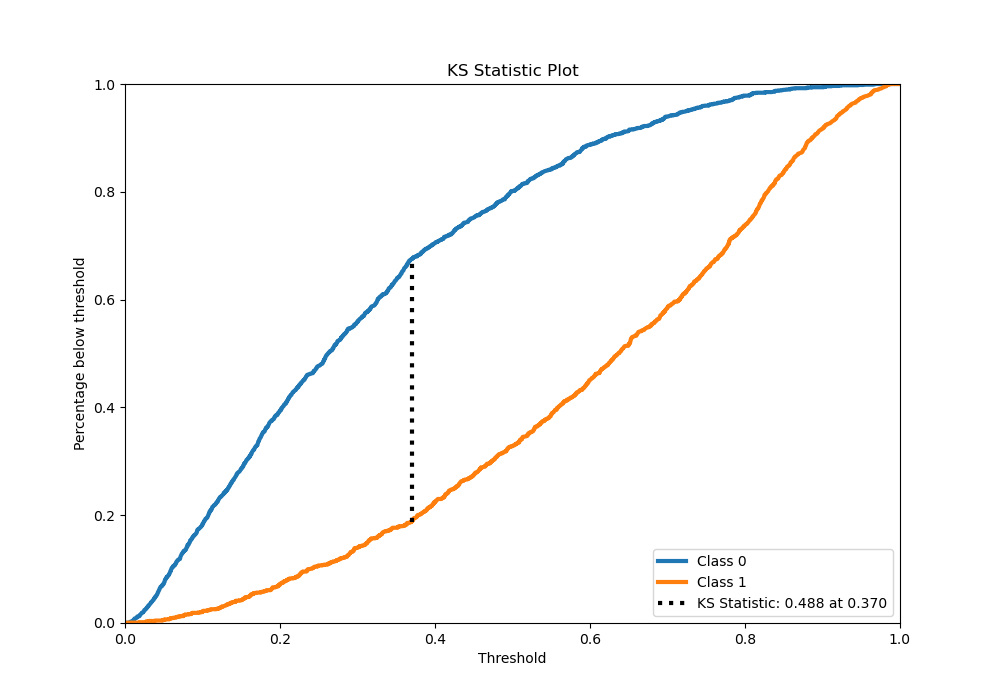
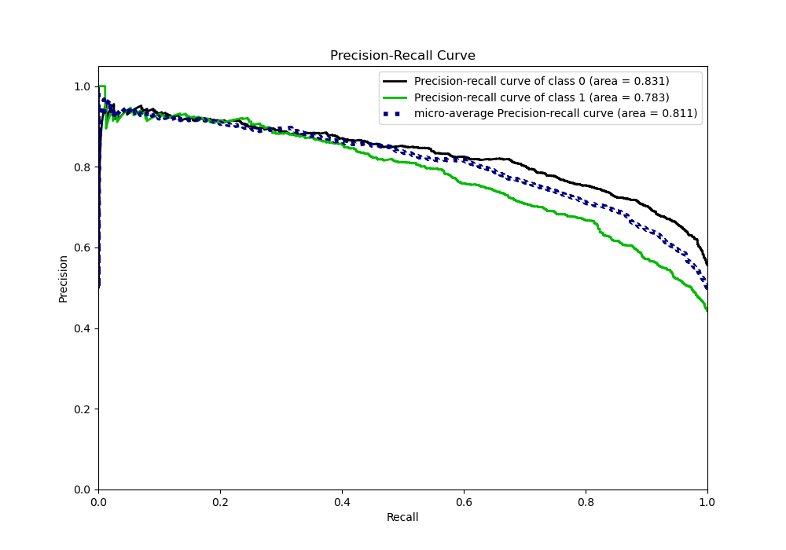
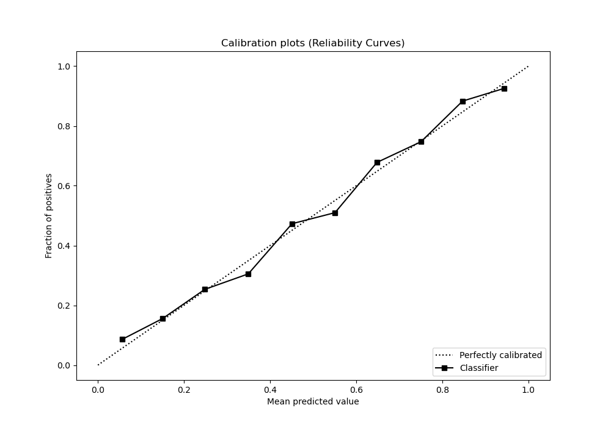
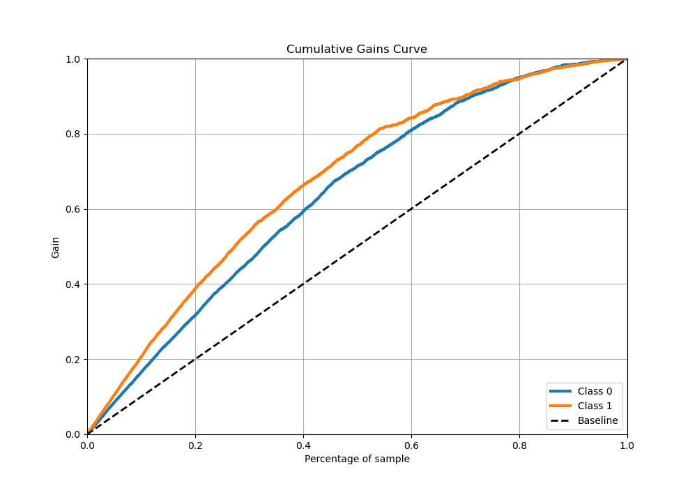
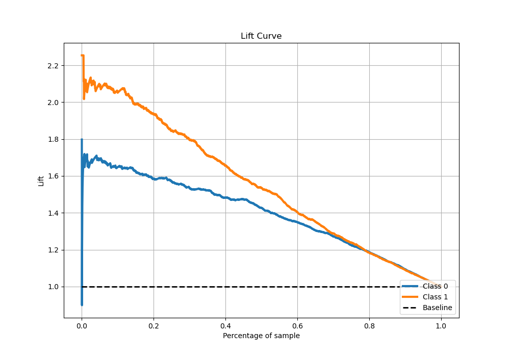

# Summary of 5_Xgboost

[<< Go back](../README.md)

## Extreme Gradient Boosting (Xgboost)
- **n_jobs**: -1
- **objective**: binary:logistic
- **eta**: 0.15
- **max_depth**: 8
- **min_child_weight**: 50
- **subsample**: 0.6
- **colsample_bytree**: 0.6
- **eval_metric**: auc
- **explain_level**: 1

## Validation
 - **validation_type**: kfold
 - **k_folds**: 5
 - **shuffle**: True
 - **stratify**: True

## Optimized metric
auc

## Training time

28.3 seconds

## Metric details
|           |    score |    threshold |
|:----------|---------:|-------------:|
| logloss   | 0.522883 | nan          |
| auc       | 0.815387 | nan          |
| f1        | 0.730769 |   0.366033   |
| accuracy  | 0.744163 |   0.509092   |
| precision | 0.929348 |   0.870815   |
| recall    | 1        |   0.00144198 |
| mcc       | 0.483236 |   0.374797   |

## Metric details with threshold from accuracy metric
|           |    score |   threshold |
|:----------|---------:|------------:|
| logloss   | 0.522883 |  nan        |
| auc       | 0.815387 |  nan        |
| f1        | 0.696718 |    0.509092 |
| accuracy  | 0.744163 |    0.509092 |
| precision | 0.734779 |    0.509092 |
| recall    | 0.662406 |    0.509092 |
| mcc       | 0.47843  |    0.509092 |

## Confusion matrix (at threshold=0.509092)
|              |   Predicted as 0 |   Predicted as 1 |
|:-------------|-----------------:|-----------------:|
| Labeled as 0 |             1350 |              318 |
| Labeled as 1 |              449 |              881 |

## Learning curves

## Permutation-based Importance

## Confusion Matrix

## Normalized Confusion Matrix

## ROC Curve

## Kolmogorov-Smirnov Statistic

## Precision-Recall Curve

## Calibration Curve

## Cumulative Gains Curve

## Lift Curve

[<< Go back](../README.md)
