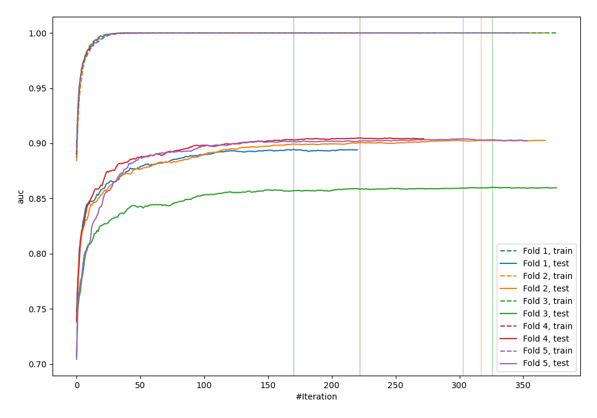
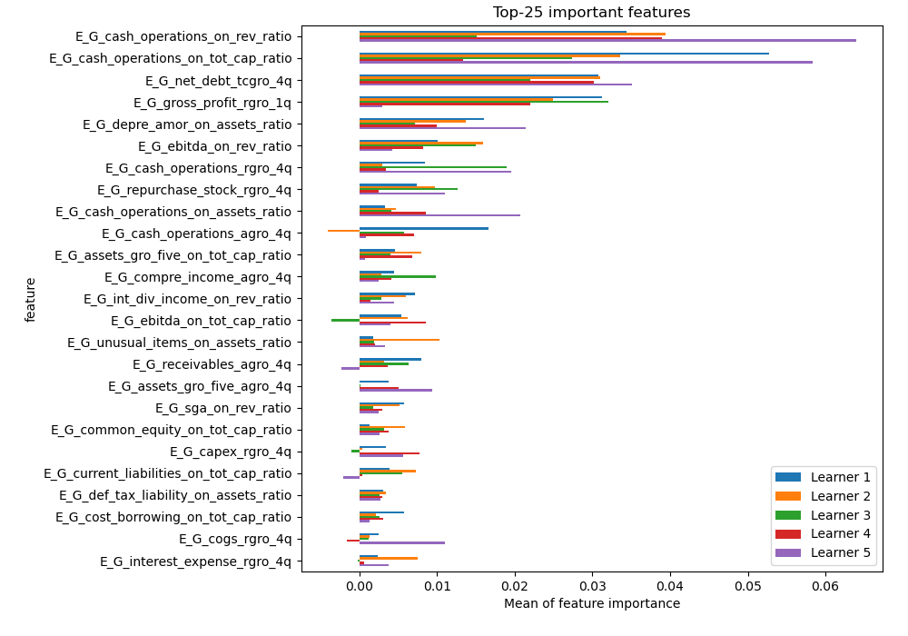
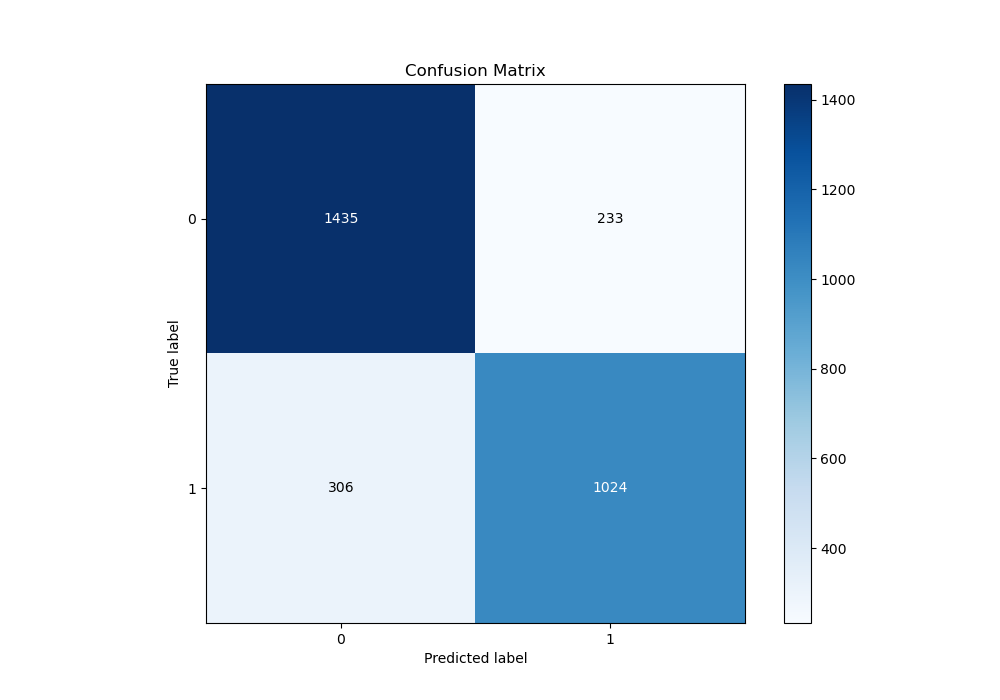
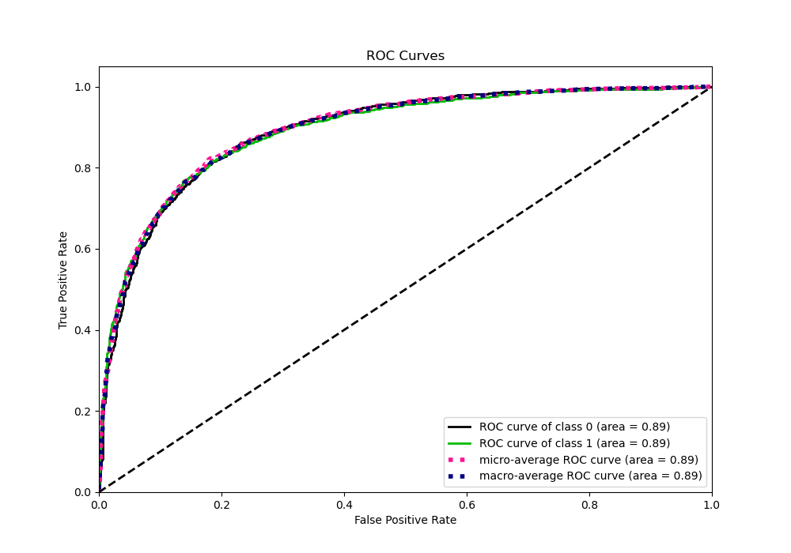
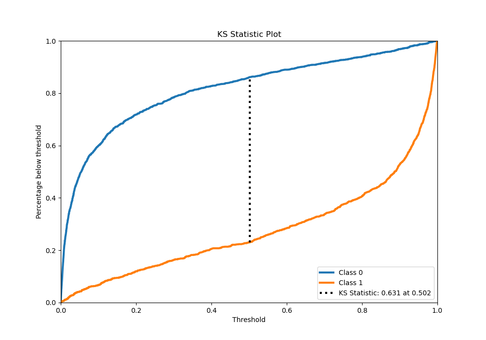
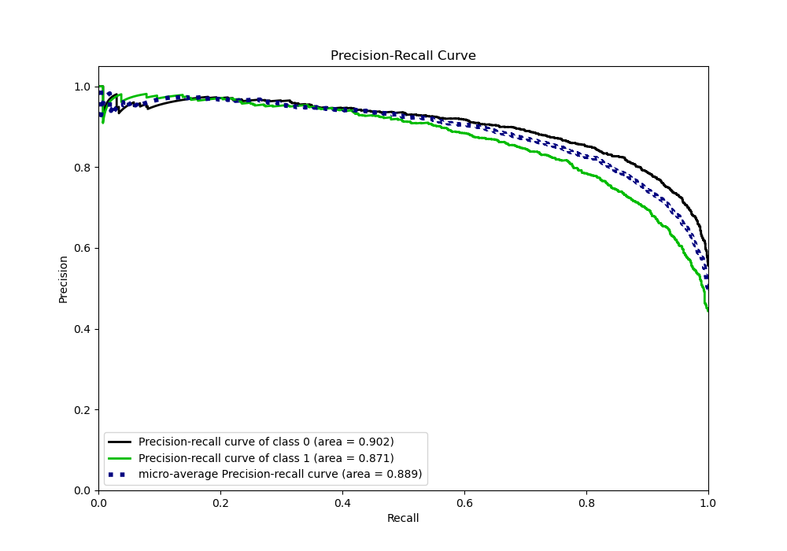
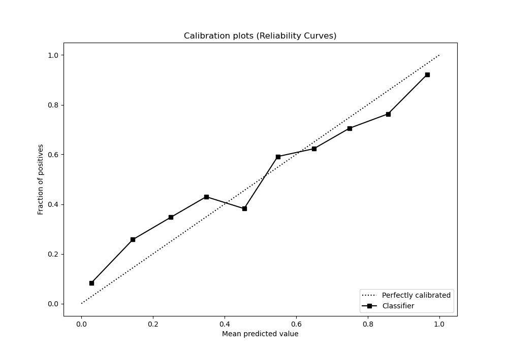
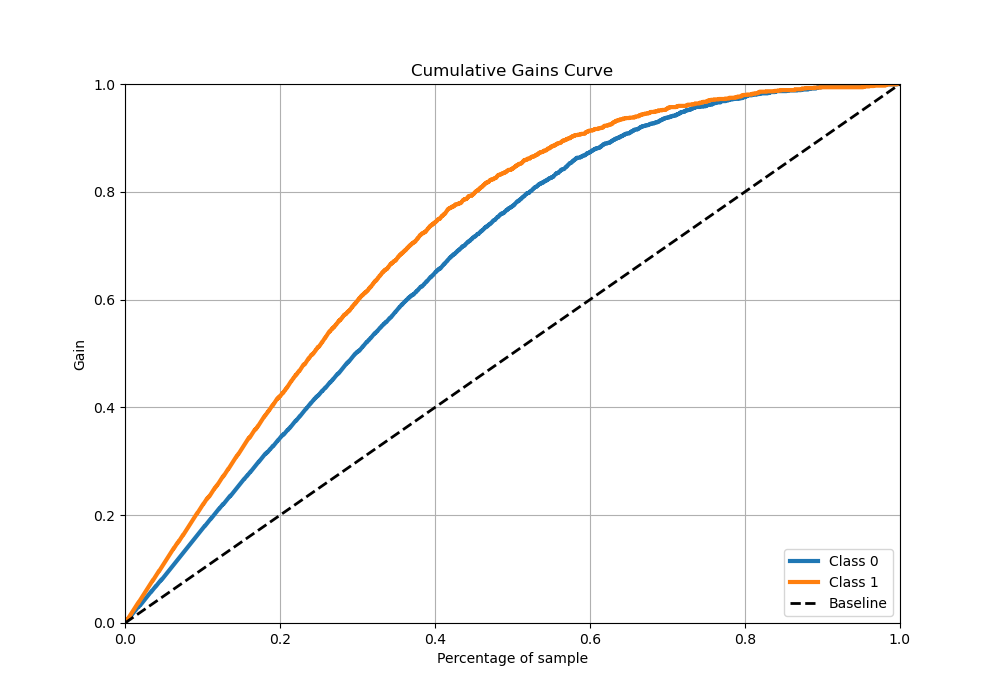
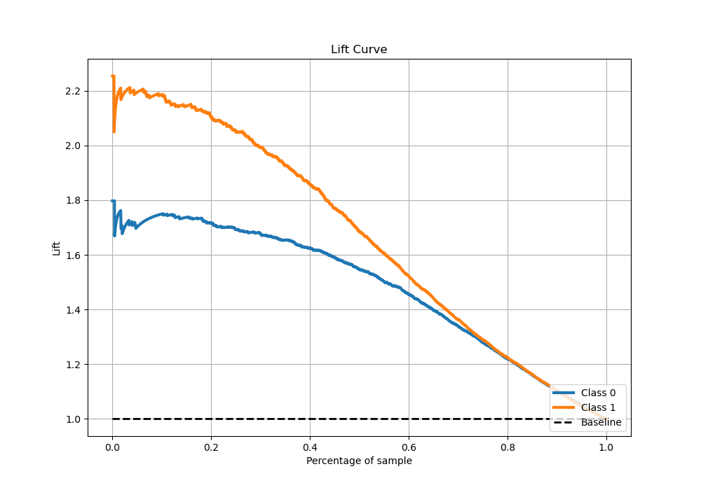

# Summary of 6_Xgboost_SelectedFeatures

[<< Go back](../README.md)

## Extreme Gradient Boosting (Xgboost)
- **n_jobs**: -1
- **objective**: binary:logistic
- **eta**: 0.1
- **max_depth**: 7
- **min_child_weight**: 1
- **subsample**: 1.0
- **colsample_bytree**: 1.0
- **eval_metric**: auc
- **explain_level**: 1

## Validation
 - **validation_type**: kfold
 - **k_folds**: 5
 - **shuffle**: True
 - **stratify**: True

## Optimized metric
auc

## Training time

12.9 seconds

## Metric details
|           |    score |     threshold |
|:----------|---------:|--------------:|
| logloss   | 0.442301 | nan           |
| auc       | 0.892208 | nan           |
| f1        | 0.795754 |   0.353203    |
| accuracy  | 0.820213 |   0.50013     |
| precision | 0.978261 |   0.988445    |
| recall    | 1        |   0.000148708 |
| mcc       | 0.634542 |   0.50013     |

## Metric details with threshold from accuracy metric
|           |    score |   threshold |
|:----------|---------:|------------:|
| logloss   | 0.442301 |   nan       |
| auc       | 0.892208 |   nan       |
| f1        | 0.791651 |     0.50013 |
| accuracy  | 0.820213 |     0.50013 |
| precision | 0.814638 |     0.50013 |
| recall    | 0.769925 |     0.50013 |
| mcc       | 0.634542 |     0.50013 |

## Confusion matrix (at threshold=0.50013)
|              |   Predicted as 0 |   Predicted as 1 |
|:-------------|-----------------:|-----------------:|
| Labeled as 0 |             1435 |              233 |
| Labeled as 1 |              306 |             1024 |

## Learning curves

## Permutation-based Importance

## Confusion Matrix

## Normalized Confusion Matrix

## ROC Curve

## Kolmogorov-Smirnov Statistic

## Precision-Recall Curve

## Calibration Curve

## Cumulative Gains Curve

## Lift Curve

[<< Go back](../README.md)
