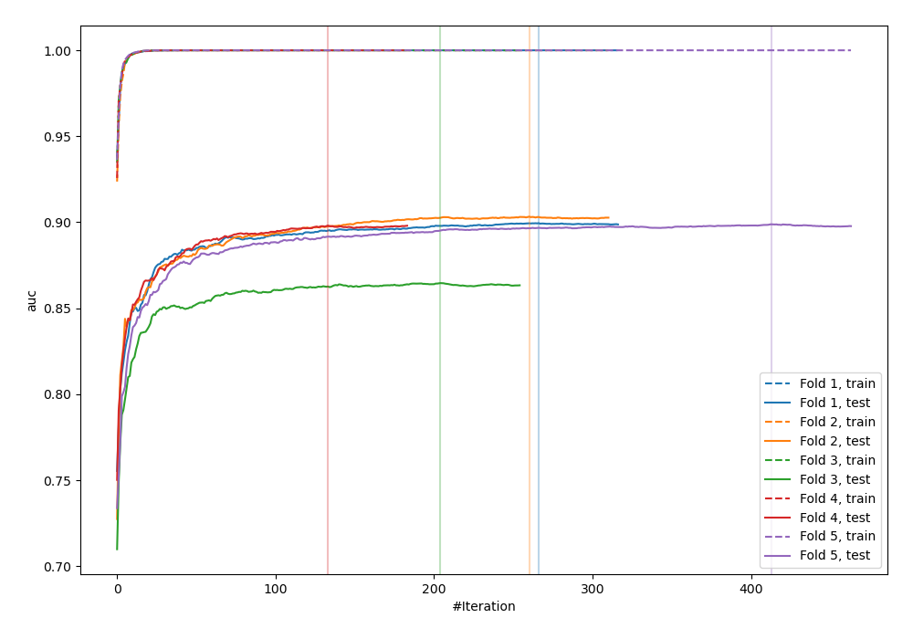
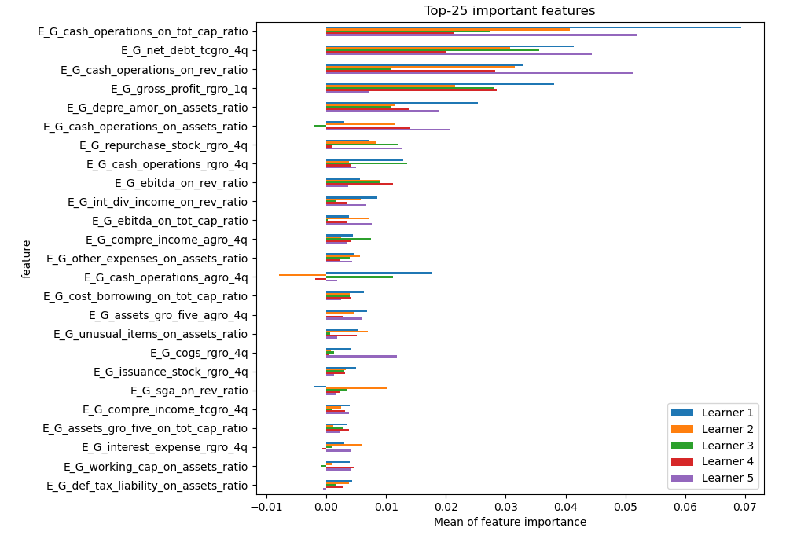
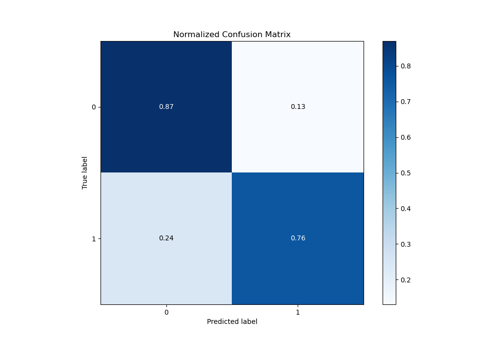
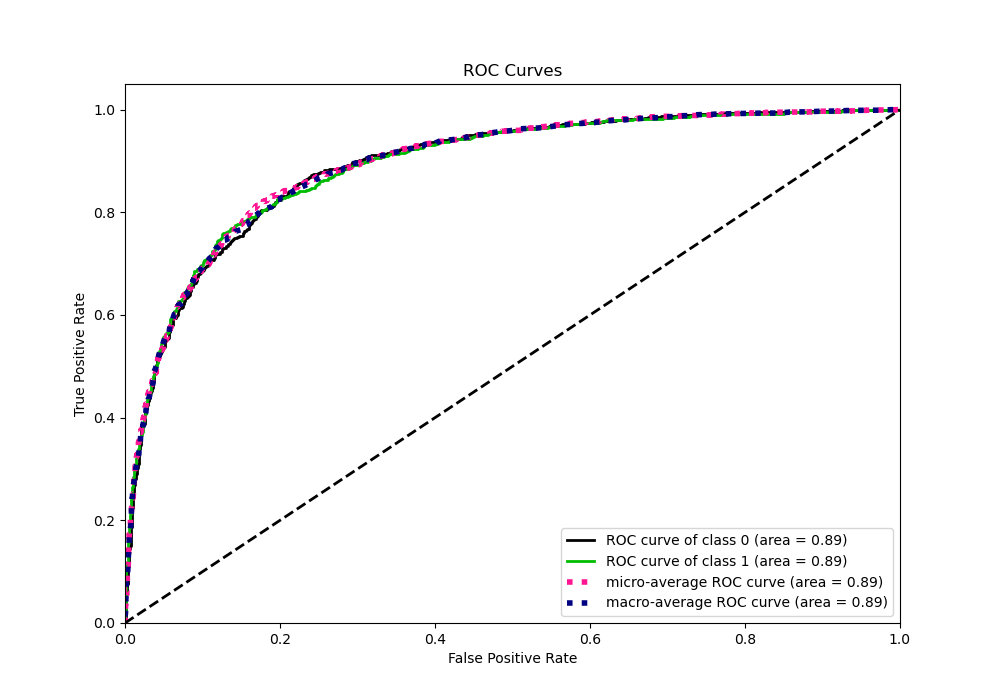
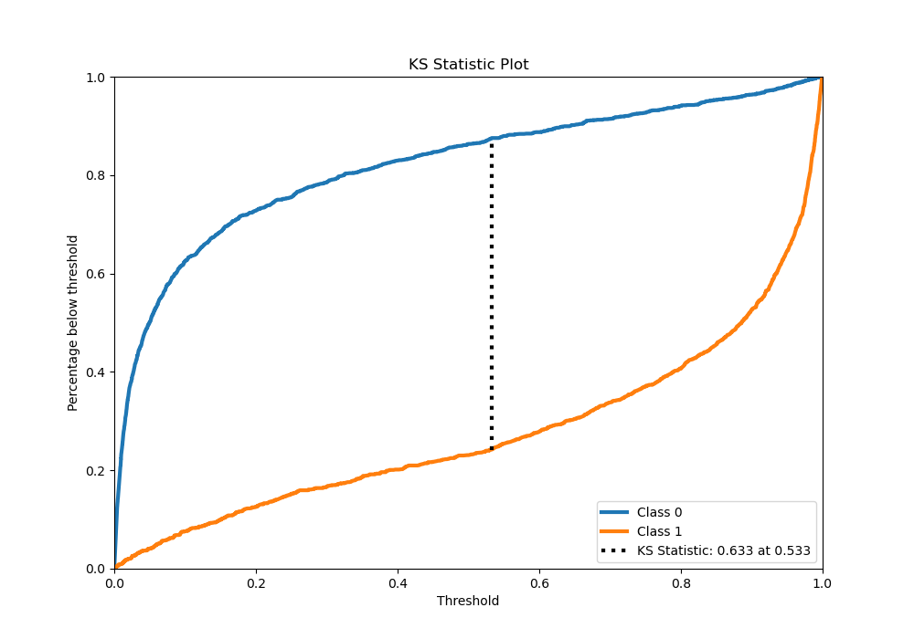
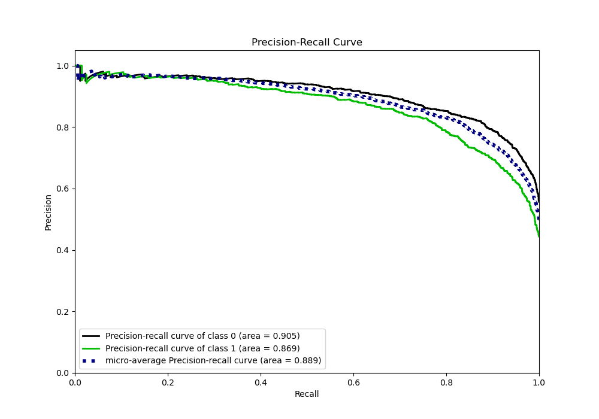
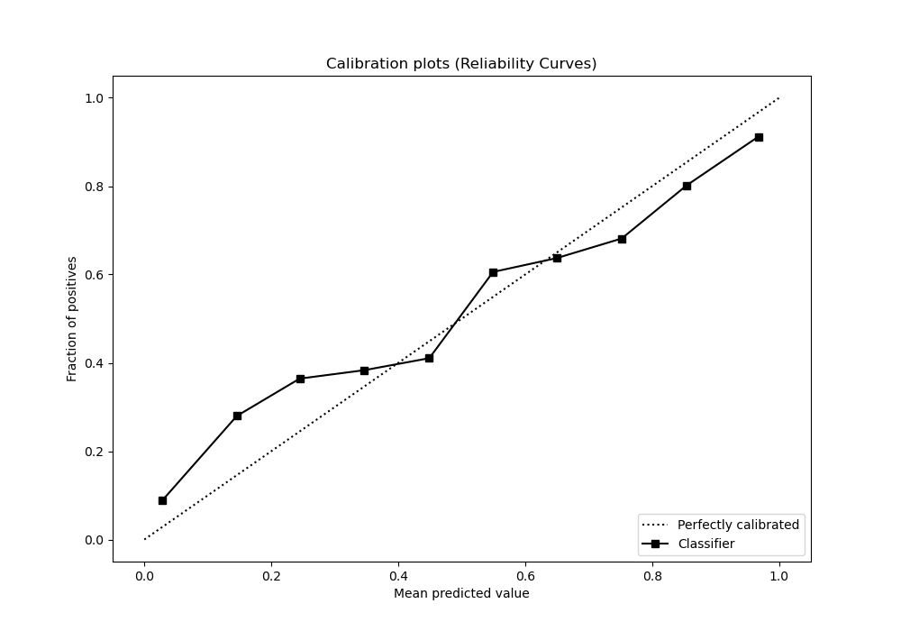
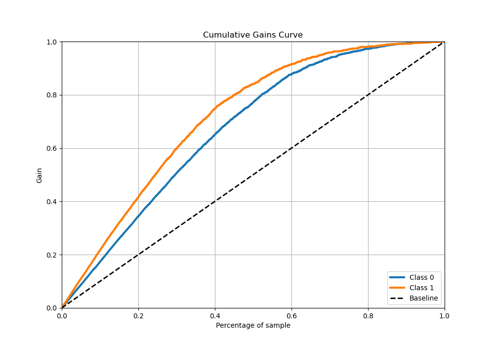
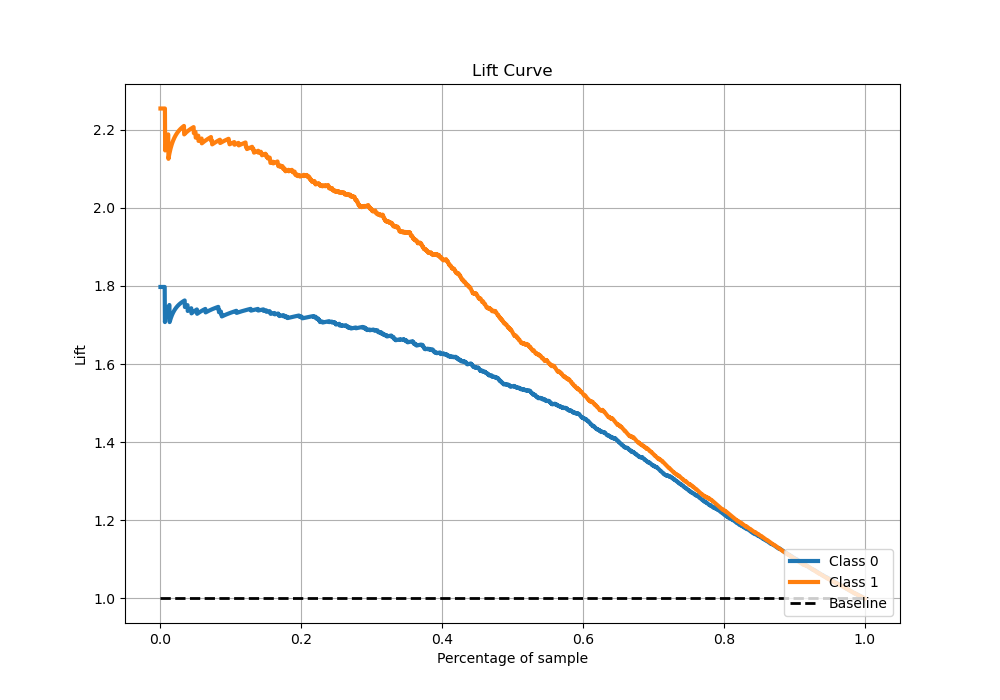

# Summary of 7_Xgboost_SelectedFeatures

[<< Go back](../README.md)

## Extreme Gradient Boosting (Xgboost)
- **n_jobs**: -1
- **objective**: binary:logistic
- **eta**: 0.1
- **max_depth**: 9
- **min_child_weight**: 1
- **subsample**: 1.0
- **colsample_bytree**: 1.0
- **eval_metric**: auc
- **explain_level**: 1

## Validation
 - **validation_type**: kfold
 - **k_folds**: 5
 - **shuffle**: True
 - **stratify**: True

## Optimized metric
auc

## Training time

14.7 seconds

## Metric details
|           |    score |     threshold |
|:----------|---------:|--------------:|
| logloss   | 0.446341 | nan           |
| auc       | 0.892335 | nan           |
| f1        | 0.796088 |   0.324891    |
| accuracy  | 0.821214 |   0.525974    |
| precision | 0.97619  |   0.992612    |
| recall    | 1        |   6.64912e-05 |
| mcc       | 0.636526 |   0.525974    |

## Metric details with threshold from accuracy metric
|           |    score |   threshold |
|:----------|---------:|------------:|
| logloss   | 0.446341 |  nan        |
| auc       | 0.892335 |  nan        |
| f1        | 0.790461 |    0.525974 |
| accuracy  | 0.821214 |    0.525974 |
| precision | 0.82329  |    0.525974 |
| recall    | 0.76015  |    0.525974 |
| mcc       | 0.636526 |    0.525974 |

## Confusion matrix (at threshold=0.525974)
|              |   Predicted as 0 |   Predicted as 1 |
|:-------------|-----------------:|-----------------:|
| Labeled as 0 |             1451 |              217 |
| Labeled as 1 |              319 |             1011 |

## Learning curves

## Permutation-based Importance

## Confusion Matrix

## Normalized Confusion Matrix

## ROC Curve

## Kolmogorov-Smirnov Statistic

## Precision-Recall Curve

## Calibration Curve

## Cumulative Gains Curve

## Lift Curve

[<< Go back](../README.md)
