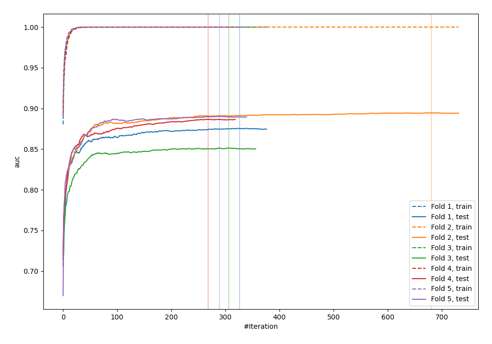
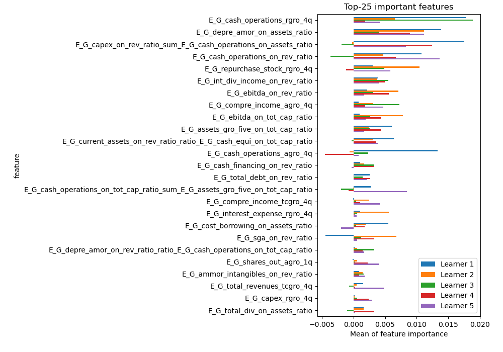
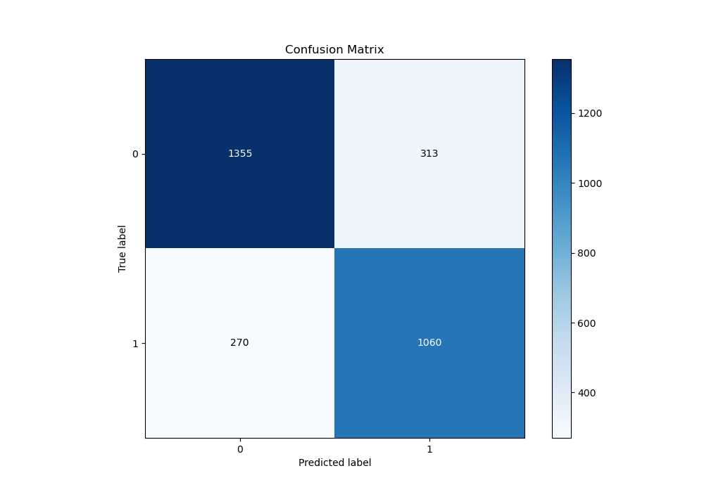
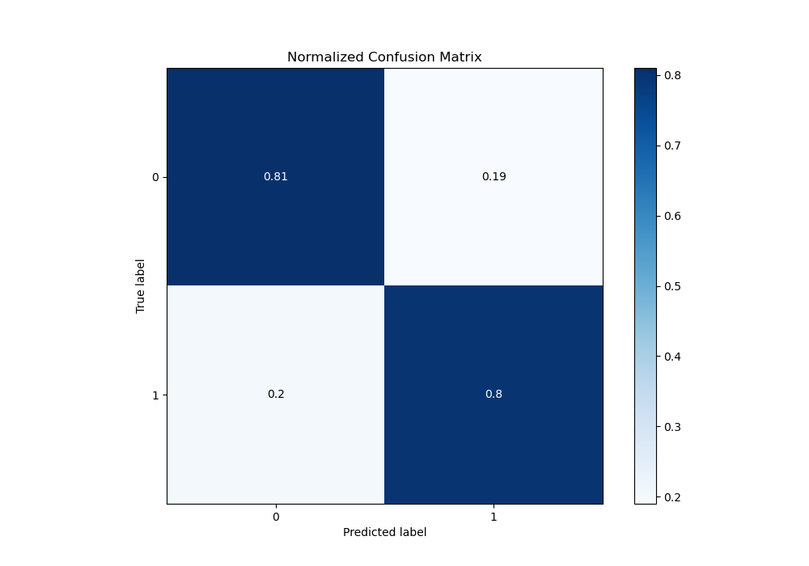
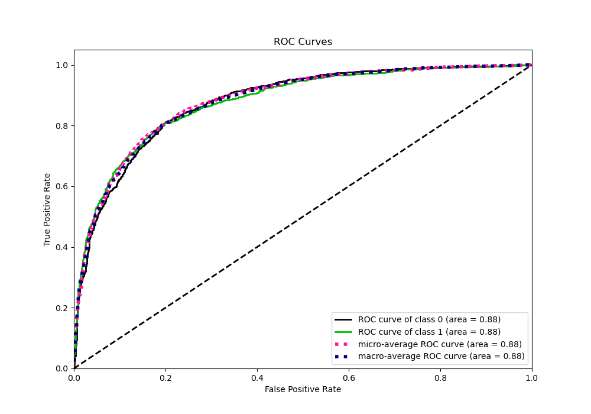
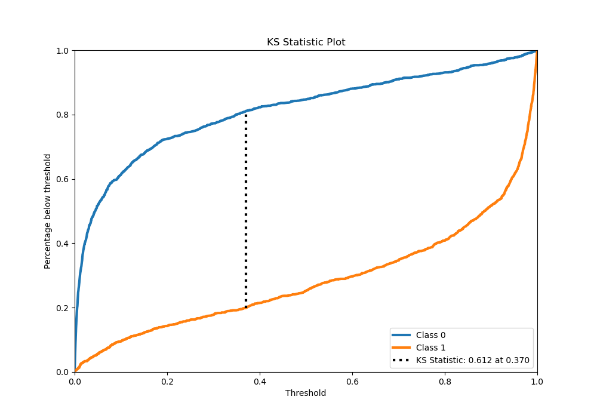
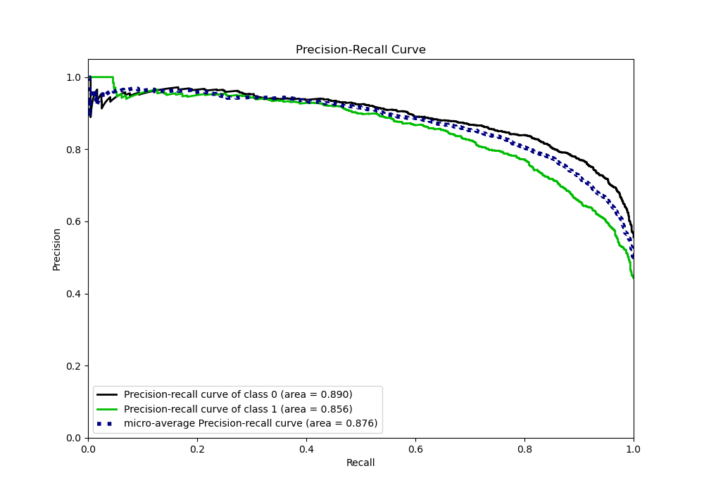
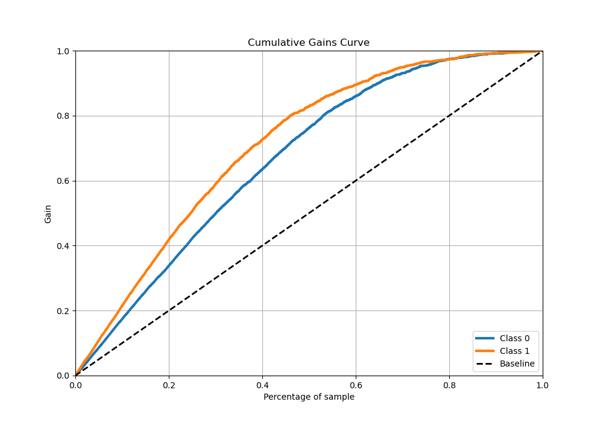
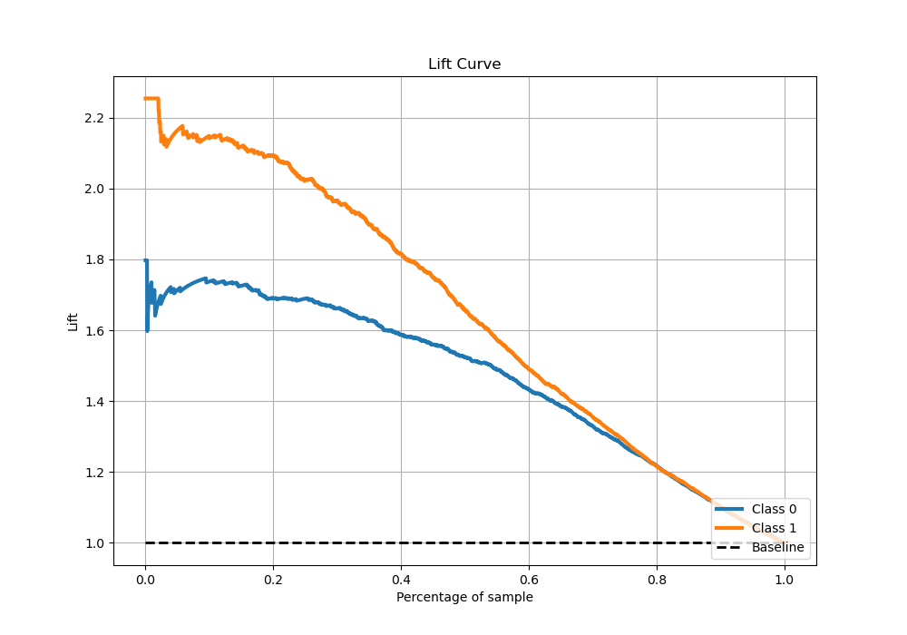

# Summary of 8_Xgboost_GoldenFeatures

[<< Go back](../README.md)

## Extreme Gradient Boosting (Xgboost)
- **n_jobs**: -1
- **objective**: binary:logistic
- **eta**: 0.1
- **max_depth**: 7
- **min_child_weight**: 1
- **subsample**: 1.0
- **colsample_bytree**: 1.0
- **eval_metric**: auc
- **explain_level**: 1

## Validation
 - **validation_type**: kfold
 - **k_folds**: 5
 - **shuffle**: True
 - **stratify**: True

## Optimized metric
auc

## Training time

62.2 seconds

## Metric details
|           |    score |     threshold |
|:----------|---------:|--------------:|
| logloss   | 0.492642 | nan           |
| auc       | 0.879324 | nan           |
| f1        | 0.784773 |   0.355401    |
| accuracy  | 0.805537 |   0.37481     |
| precision | 0.96129  |   0.992934    |
| recall    | 1        |   7.16735e-05 |
| mcc       | 0.607608 |   0.37481     |

## Metric details with threshold from accuracy metric
|           |    score |   threshold |
|:----------|---------:|------------:|
| logloss   | 0.492642 |   nan       |
| auc       | 0.879324 |   nan       |
| f1        | 0.784314 |     0.37481 |
| accuracy  | 0.805537 |     0.37481 |
| precision | 0.772032 |     0.37481 |
| recall    | 0.796992 |     0.37481 |
| mcc       | 0.607608 |     0.37481 |

## Confusion matrix (at threshold=0.37481)
|              |   Predicted as 0 |   Predicted as 1 |
|:-------------|-----------------:|-----------------:|
| Labeled as 0 |             1355 |              313 |
| Labeled as 1 |              270 |             1060 |

## Learning curves

## Permutation-based Importance

## Confusion Matrix

## Normalized Confusion Matrix

## ROC Curve

## Kolmogorov-Smirnov Statistic

## Precision-Recall Curve

## Calibration Curve

## Cumulative Gains Curve

## Lift Curve

[<< Go back](../README.md)
