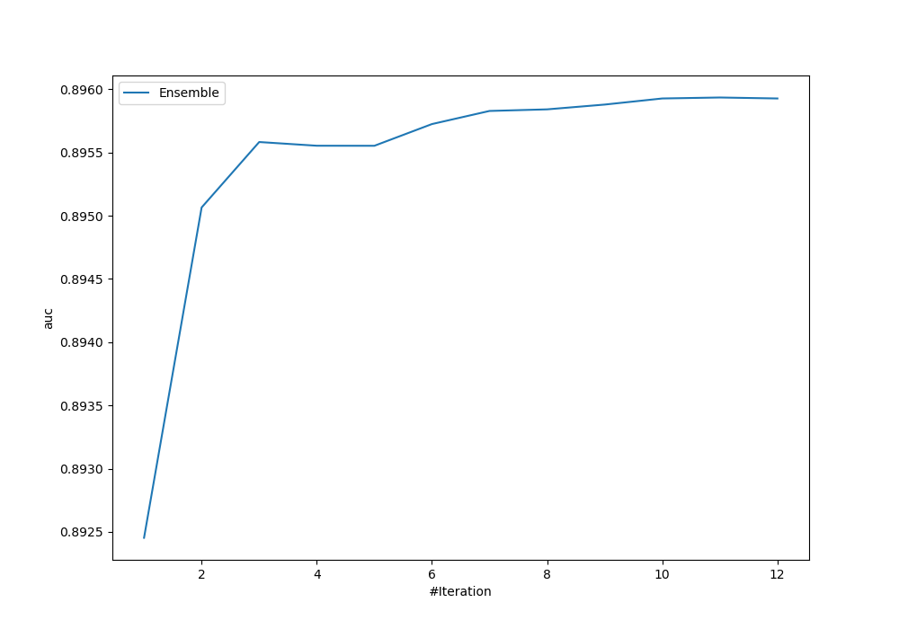
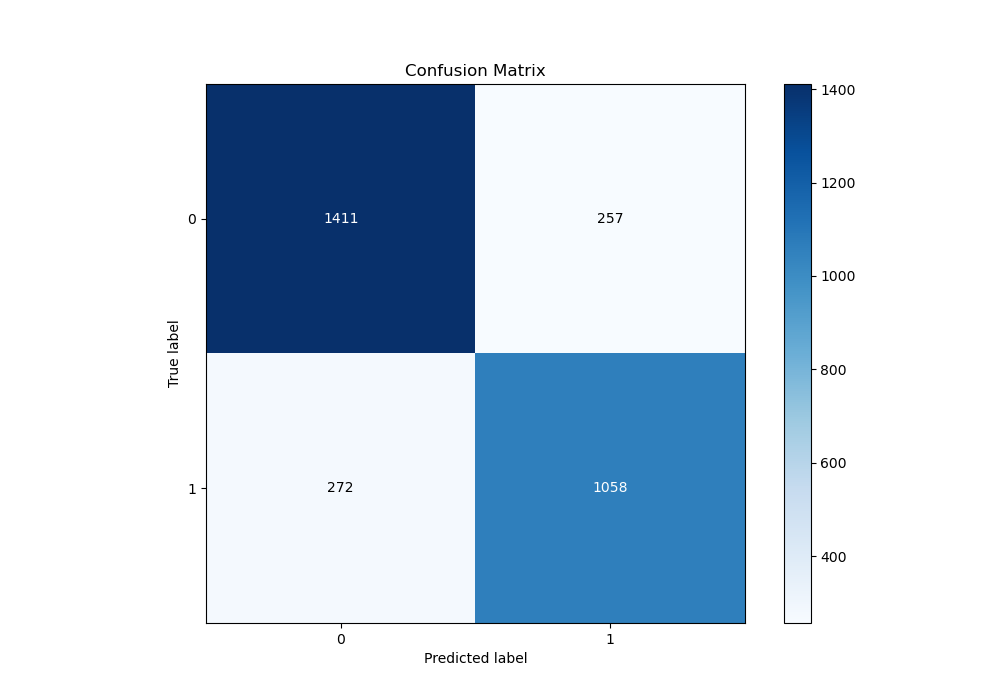
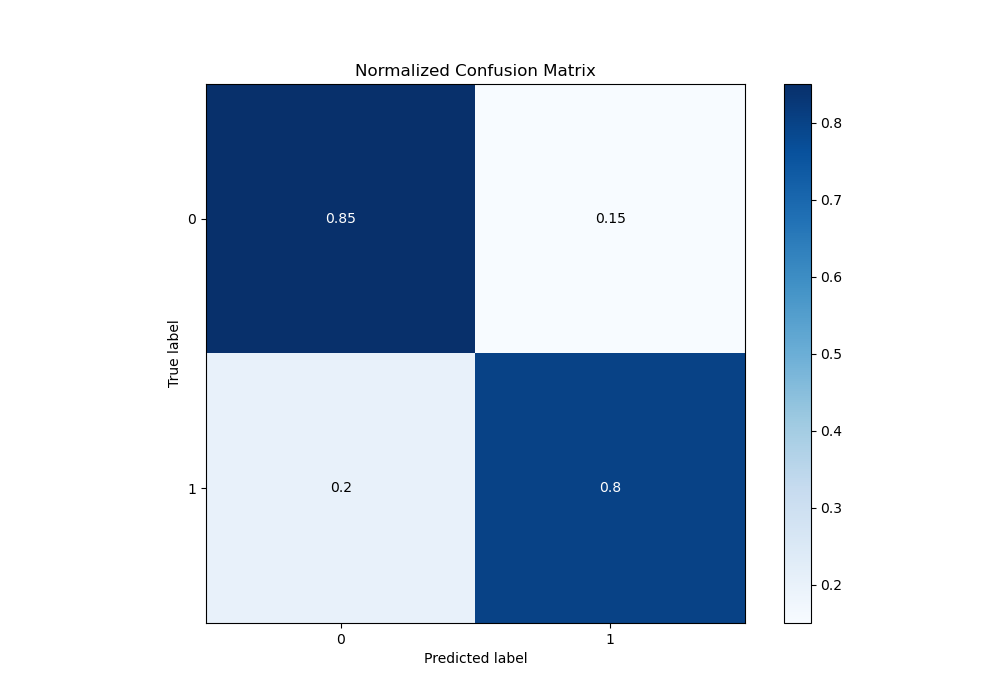
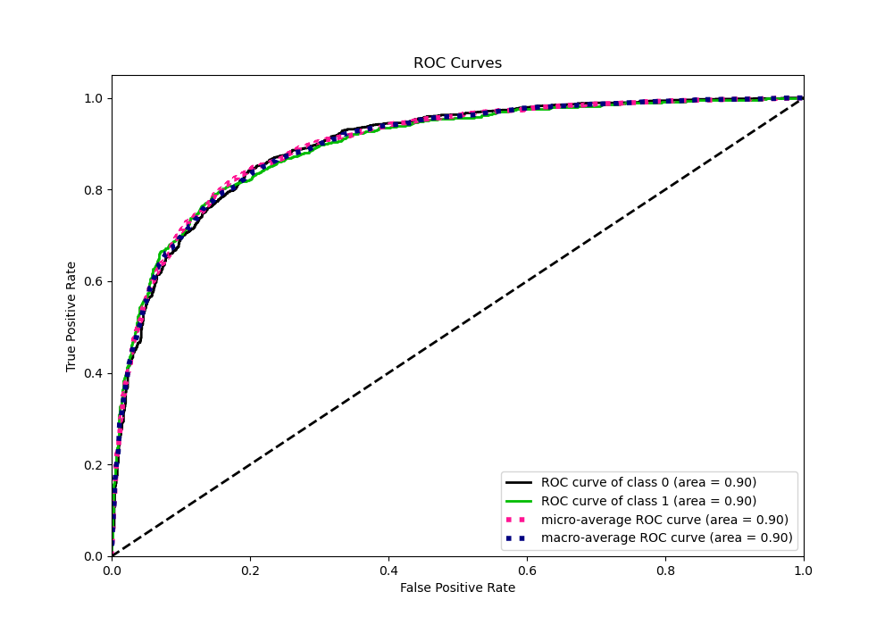
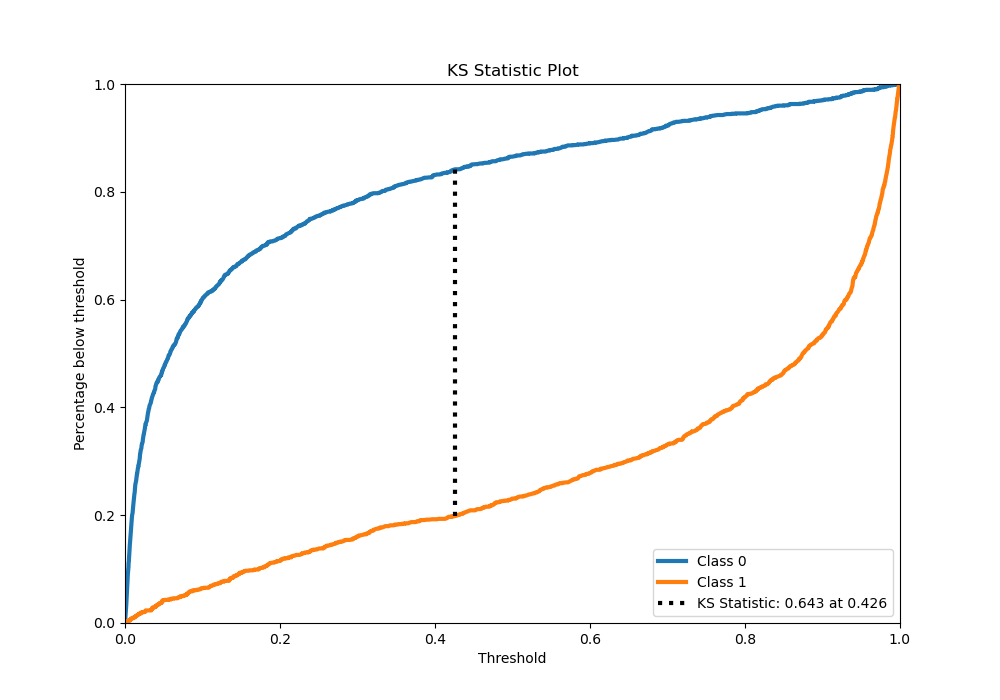
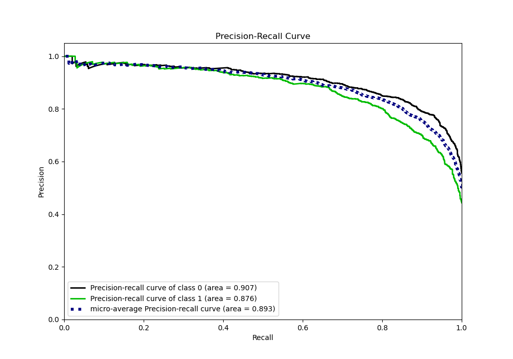
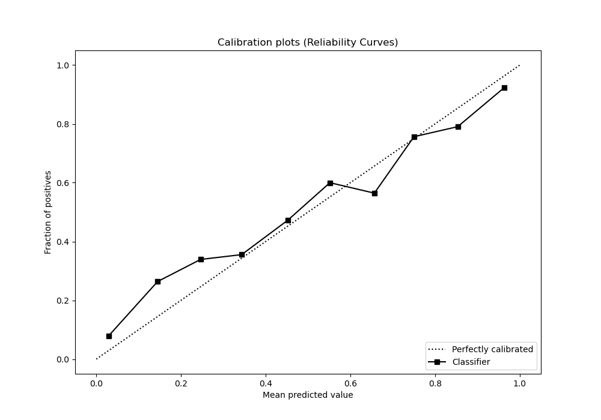
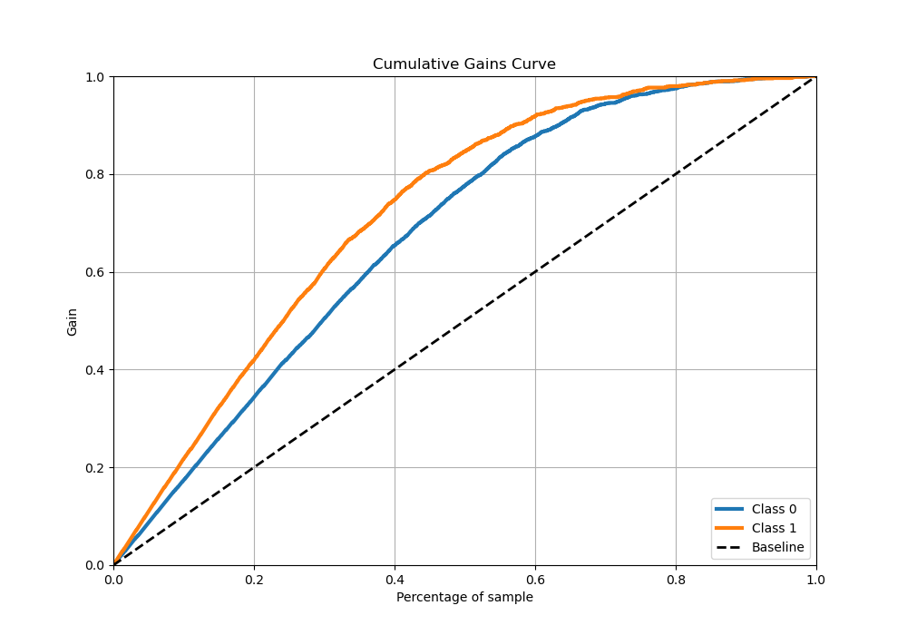
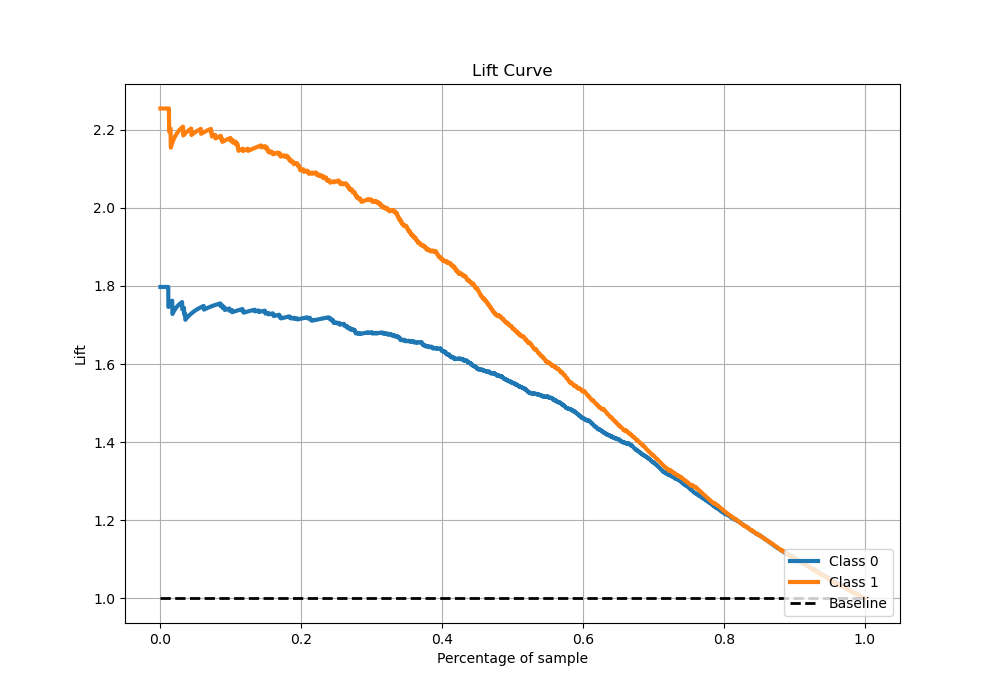

# Summary of Ensemble

[<< Go back](../README.md)

## Ensemble structure
| Model                       |   Weight |
|:----------------------------|---------:|
| 10_Xgboost_SelectedFeatures |        4 |
| 3_Xgboost_SelectedFeatures  |        1 |
| 6_Xgboost_SelectedFeatures  |        2 |
| 7_Xgboost_SelectedFeatures  |        3 |
| 9_Xgboost_GoldenFeatures    |        1 |

## Metric details
|           |    score |     threshold |
|:----------|---------:|--------------:|
| logloss   | 0.428106 | nan           |
| auc       | 0.895935 | nan           |
| f1        | 0.800299 |   0.415725    |
| accuracy  | 0.823549 |   0.438151    |
| precision | 0.976526 |   0.984019    |
| recall    | 1        |   0.000265256 |
| mcc       | 0.642179 |   0.438151    |

## Metric details with threshold from accuracy metric
|           |    score |   threshold |
|:----------|---------:|------------:|
| logloss   | 0.428106 |  nan        |
| auc       | 0.895935 |  nan        |
| f1        | 0.8      |    0.438151 |
| accuracy  | 0.823549 |    0.438151 |
| precision | 0.804563 |    0.438151 |
| recall    | 0.795489 |    0.438151 |
| mcc       | 0.642179 |    0.438151 |

## Confusion matrix (at threshold=0.438151)
|              |   Predicted as 0 |   Predicted as 1 |
|:-------------|-----------------:|-----------------:|
| Labeled as 0 |             1411 |              257 |
| Labeled as 1 |              272 |             1058 |

## Learning curves

## Confusion Matrix

## Normalized Confusion Matrix

## ROC Curve

## Kolmogorov-Smirnov Statistic

## Precision-Recall Curve

## Calibration Curve

## Cumulative Gains Curve

## Lift Curve

[<< Go back](../README.md)
