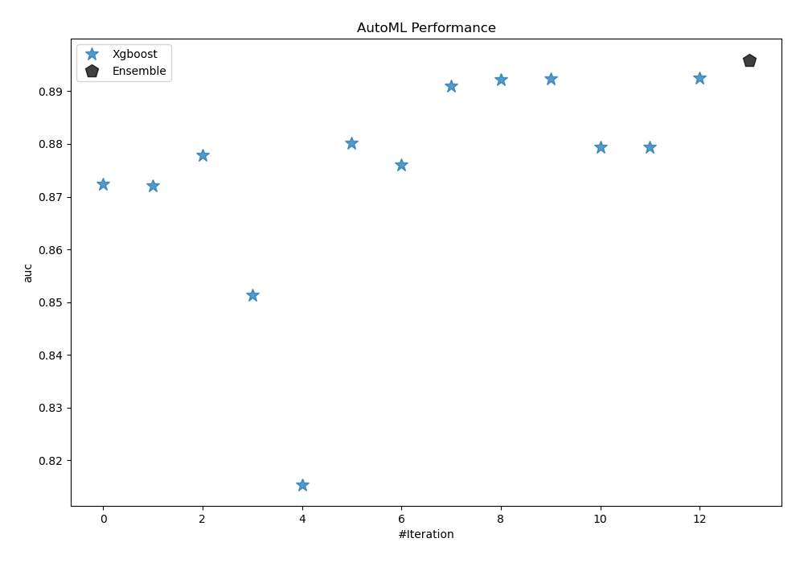
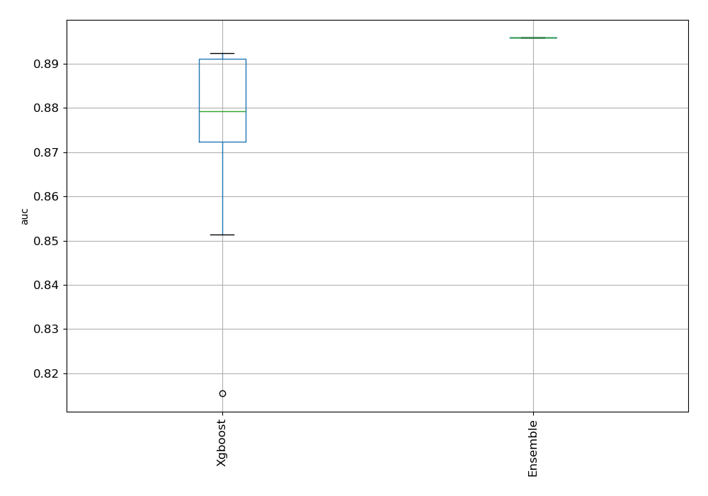
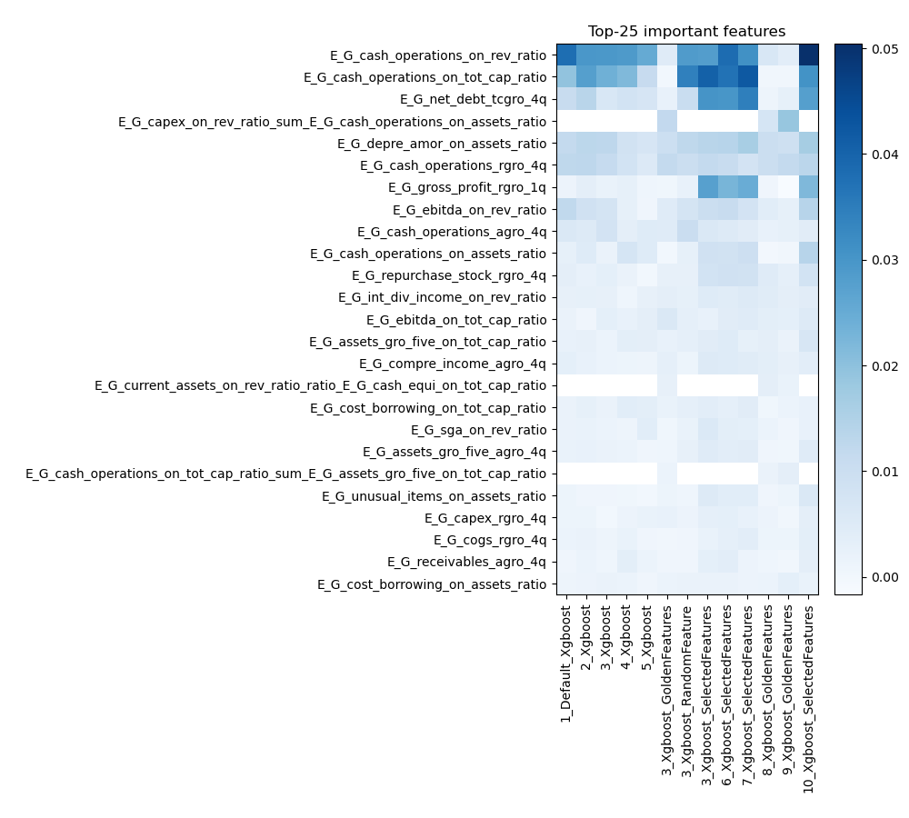
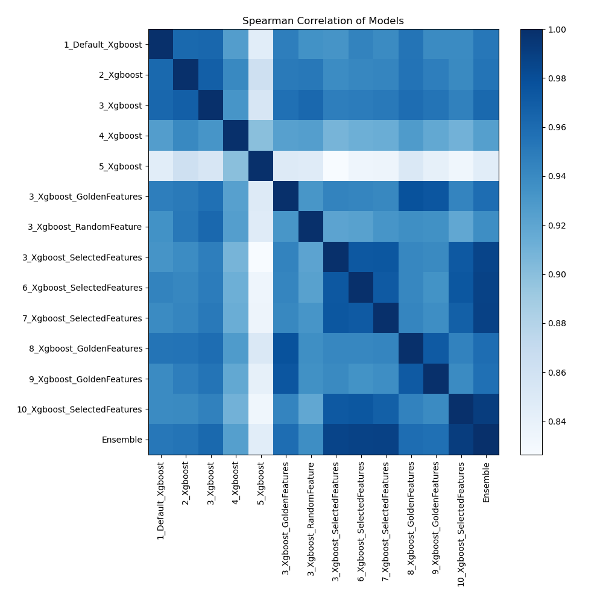

# AutoML Leaderboard

| Best model   | name                                                                 | model_type   | metric_type   |   metric_value |   train_time |   single_prediction_time |
|:-------------|:---------------------------------------------------------------------|:-------------|:--------------|---------------:|-------------:|-------------------------:|
|              | [1_Default_Xgboost](1_Default_Xgboost/README.md)                     | Xgboost      | auc           |       0.872407 |        48.61 |                   0.1489 |
|              | [2_Xgboost](2_Xgboost/README.md)                                     | Xgboost      | auc           |       0.872118 |        46.31 |                   0.1558 |
|              | [3_Xgboost](3_Xgboost/README.md)                                     | Xgboost      | auc           |       0.877816 |        49.81 |                   0.1772 |
|              | [4_Xgboost](4_Xgboost/README.md)                                     | Xgboost      | auc           |       0.851289 |        33.9  |                   0.1735 |
|              | [5_Xgboost](5_Xgboost/README.md)                                     | Xgboost      | auc           |       0.815387 |        28.78 |                   0.0929 |
|              | [3_Xgboost_GoldenFeatures](3_Xgboost_GoldenFeatures/README.md)       | Xgboost      | auc           |       0.880125 |      2423.17 |                   0.1537 |
|              | [3_Xgboost_RandomFeature](3_Xgboost_RandomFeature/README.md)         | Xgboost      | auc           |       0.875955 |       233.38 |                   0.0998 |
|              | [3_Xgboost_SelectedFeatures](3_Xgboost_SelectedFeatures/README.md)   | Xgboost      | auc           |       0.891052 |        13.07 |                   0.0285 |
|              | [6_Xgboost_SelectedFeatures](6_Xgboost_SelectedFeatures/README.md)   | Xgboost      | auc           |       0.892208 |        13.38 |                   0.0282 |
|              | [7_Xgboost_SelectedFeatures](7_Xgboost_SelectedFeatures/README.md)   | Xgboost      | auc           |       0.892335 |        15.21 |                   0.0296 |
|              | [8_Xgboost_GoldenFeatures](8_Xgboost_GoldenFeatures/README.md)       | Xgboost      | auc           |       0.879324 |        62.71 |                   0.1584 |
|              | [9_Xgboost_GoldenFeatures](9_Xgboost_GoldenFeatures/README.md)       | Xgboost      | auc           |       0.879366 |        60.15 |                   0.1601 |
|              | [10_Xgboost_SelectedFeatures](10_Xgboost_SelectedFeatures/README.md) | Xgboost      | auc           |       0.892453 |        14.23 |                   0.0277 |
| **the best** | [Ensemble](Ensemble/README.md)                                       | Ensemble     | auc           |       0.895935 |         0.99 |                   0.4484 |

### AutoML Performance

### AutoML Performance Boxplot

### Features Importance

### Spearman Correlation of Models

